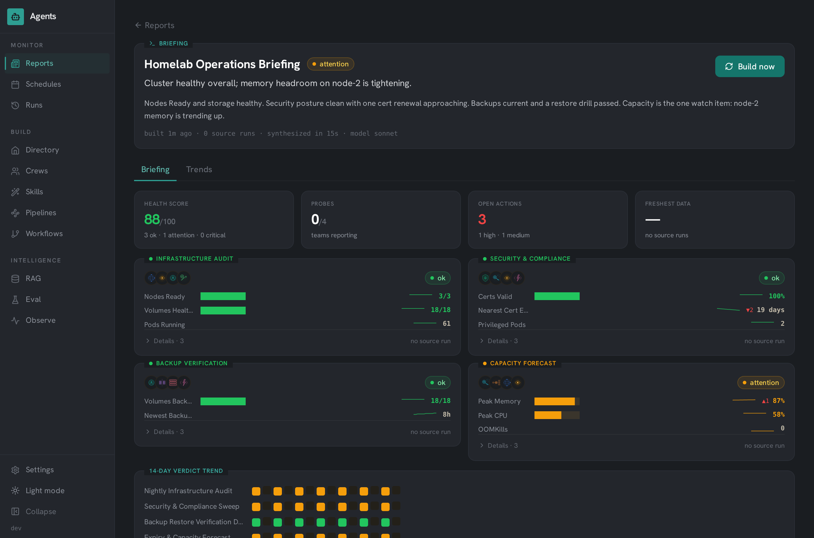
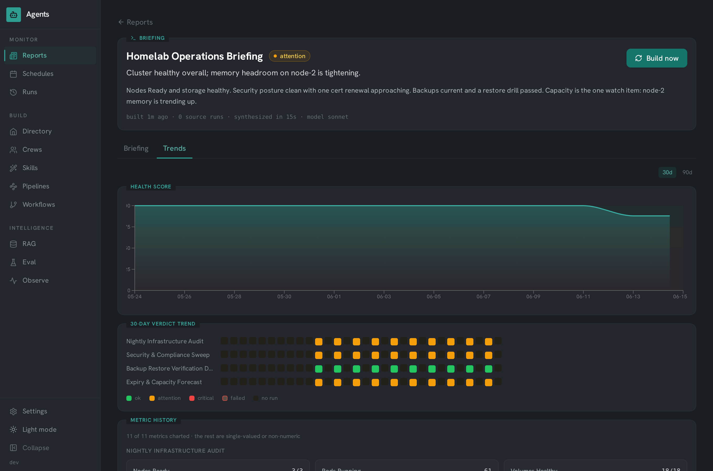
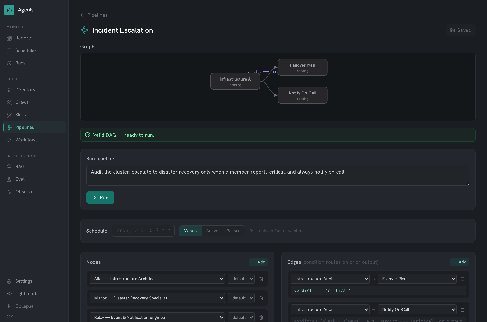
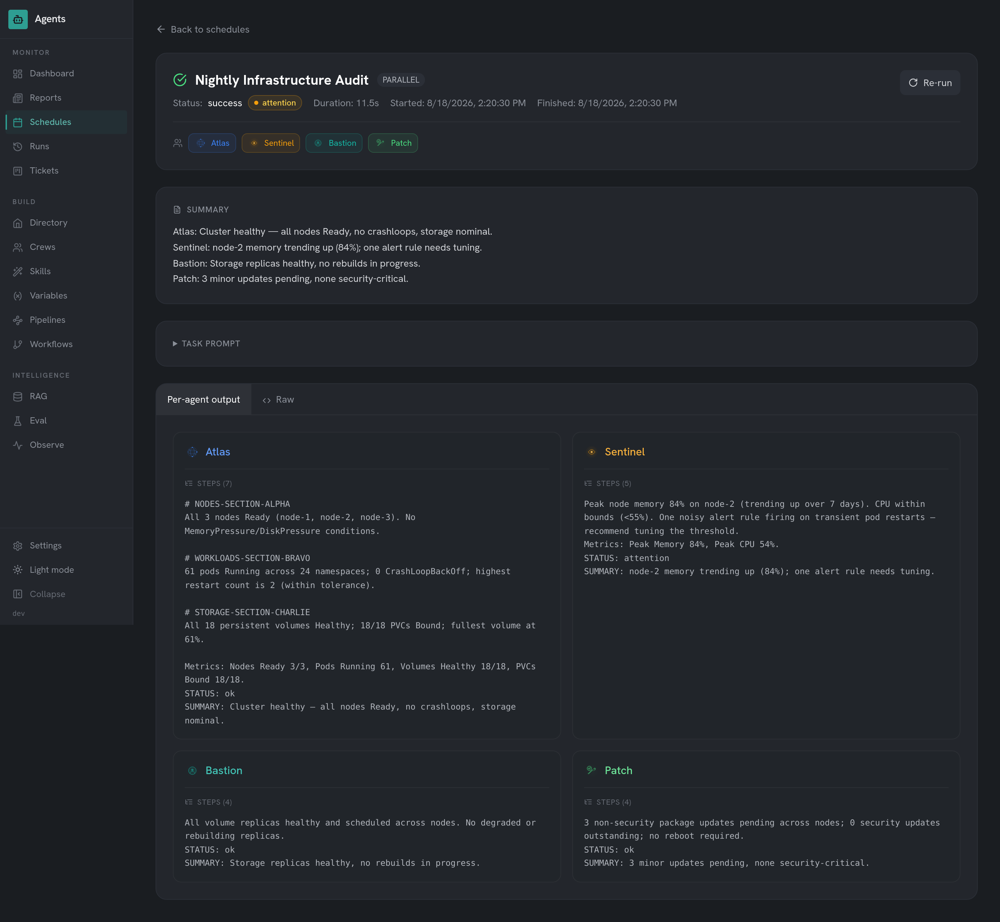

# agents-platform

[](https://github.com/kernelpanic09/agents-platform/actions/workflows/ci.yml)
[](LICENSE)
[](https://github.com/kernelpanic09/agents-platform/releases)
[](https://github.com/kernelpanic09/agents-platform/commits)

An AI agent orchestration platform: a roster of agent personas equipped with **skills (the SKILL.md open standard), provisioned MCP tool servers, and episodic memory**, dispatched against real infrastructure, composed into conditional DAG pipelines and reusable crews, streamed live over SSE **down to the individual tool call**, governed by tiered safety policies and scoped API keys, and improved over time with prompt versioning, A/B evals, and a promote-to-active loop. Recurring runs fuse into **AI-synthesized Combined Reports with metric trends**, all wrapped in a flat **light/dark dashboard** - with full cost/latency observability and platform SLOs.


*Composing a scheduled multi-agent operation: pick the agents, choose how they execute (parallel / sequential / meeting), select an execution backend and an enforced safety tier, cap the agentic turns, and set the cadence - every knob shown is a real control, not chrome.*

---

## What is this

Agents Platform is a full-stack application for building, managing, and running AI agents. Each agent has a persona, system prompt, attached **skills** (SKILL.md), declared **MCP servers** (provisioned into dispatch), **episodic memory** (distilled from past runs), knowledge sources, and its own inference profile (model, temperature, max tokens). The platform dispatches agents via SSH to a remote Claude Code session (or the Anthropic API), routes multi-agent work through LangGraph - including user-built DAG pipelines with conditional branching - tracks every run with token/cost/latency telemetry **down to per-tool-call step timelines**, and streams run progress live into the UI.

It ships with 20 pre-built agent personas covering infrastructure, development, security, media, and automation domains, plus 10 production-grade schedule templates. **A self-contained demo (`docker compose up`) seeds weeks of fabricated operating history** - completed runs with tool-call timelines, a Combined Report with metric trends, crews, skills, and memories - and even **fakes a live animated run on "Run now,"** so the whole platform is explorable with no SSH host, no API key, and no real data. (Every screenshot and GIF below was captured against that demo.)

The platform was built in five planned phases (visibility → configurability → trust → self-improvement → composability); the full roadmap, meeting notes, and prioritization live in [`docs/planning/`](docs/planning/).

> ### Why SSH + a terminal instead of the Anthropic API?
>
> By design, the platform runs each agent by opening an **SSH session to a host that has Claude Code installed and spawning `claude -p` in a terminal** - rather than calling the Anthropic API. That host's **Claude subscription** powers the run, so executing agents consumes subscription tokens and incurs **no per-token API charges**. For a self-hosted, always-on agent fleet (scheduled audits, multi-agent runs), this keeps operating cost minimal.
>
> **What this means in practice:**
> - **Multi-agent runs (parallel / sequential / meeting) need no `ANTHROPIC_API_KEY`** - they dispatch purely over SSH.
> - An API key is only used for the auxiliary LLM features that call Anthropic directly: **RAG chat, the eval judge, and the single-agent task router**.
>
> Prefer pay-per-token, or running headless/in-cloud where no subscription host is available? An **opt-in Anthropic API execution backend** is also supported - see [Execution backends](#execution-backends).

---

## Features

### 1. Agent Roster
- 20 persona definitions: name, title, tagline, system prompt, expertise, tools, MCP servers, knowledge sources, example tasks, and related agents
- Full CRUD via REST API and in-app forms; per-agent accent color and SVG avatar (20 unique illustrations)
- **Per-agent inference profiles** - model, temperature, and max-tokens overrides applied at execution time
- **Prompt version history** - every system-prompt edit auto-snapshots the prior version; view, diff, and restore from the agent profile
- **Adopt from catalog** - one-click adoption from a 180+ agent public catalog into the runnable roster; adopted agents carry provenance (`source_pack`) and become schedulable, crewable, and pipeline-ready alongside the built-ins

### 2. Agent Skills (the SKILL.md open standard)
- A first-class **skill library** in the format the ecosystem converged on: YAML frontmatter + markdown instructions, stored verbatim, editable in-app
- **Catalog adoption** - browse the live listing of the public [`anthropics/skills`](https://github.com/anthropics/skills) repo and adopt entries with one click; import any SKILL.md by URL (GitHub links normalized automatically)
- **Native execution** - on the SSH backend, attached skills are materialized into an isolated per-run workspace's `.claude/skills/` and Claude Code loads them natively, progressive disclosure included: the model sees name + description, and invokes the `Skill` tool to read the full instructions only when relevant. The step timeline shows the invocation
- On API backends (no skill runtime) skills are inlined into the prompt instead - same attach flow, both paths audited on the run

### 3. MCP Tool Provisioning
- Agents declare MCP servers; the DB-backed registry resolves them to launchable configs and **dispatch provisions them for real**: the config is written to the run host and passed via `--mcp-config` with `--strict-mcp-config`, so an agent gets exactly its declared servers - never whatever the host happens to have configured
- Placeholder env values in the registry are documentation, not config: they are dropped at provision time and the run host's environment supplies real values - secrets stay out of the DB by design
- Every run records what each agent was provisioned (`runs.provisioning`) and shows it as chips on the run page; meetings get the union of all participants' servers

### 4. Agent Memory (episodic)
- After each successful run, the agent's output is **distilled into durable memories** (strict extract-0-to-3-learnings contract) via the unified LLM layer - local Ollama models work, so this costs $0 with no API key; with no aux backend at all, a rule-based fallback still remembers runs that ended `attention`/`critical`
- At the next dispatch the agent's memories (pinned first, then newest) are injected as a "What you remember from previous runs" section - backend-agnostic
- Memory card on the agent profile: add manual entries, pin environment facts (pinned never expire), forget anything; every distilled memory links back to its source run
- Retention built in: 30 non-pinned memories per agent, exact-duplicate dedup

### 5. Orchestration: Modes, Pipelines, and Crews
- Runs `claude -p "<prompt>"` on a remote host over SSH - or via the Anthropic API, or **any OpenAI-compatible endpoint incl. local Ollama** (see [Execution backends](#execution-backends))
- Three composition modes: parallel (fan-out, aggregate), sequential (pipeline), meeting (structured debate)
- **DAG Pipeline Builder** - compose agents into a directed graph with **conditional edges evaluated against the prior agent's output** (e.g. `output.includes('CRITICAL')`, sandboxed in a `vm` context). Pipelines compile to LangGraph at run time and stream per-node status live onto the graph
- **Saved Crews** - named, reusable agent teams with a topology (fan / chain / round-table), one-click run or schedule, plus suggested crews derived from the related-agents graph
- Cron scheduling with configurable concurrency; per-run Discord notifications

### 6. Live Run Streaming - down to the tool call
- Every run streams **per-agent lifecycle events over SSE**: watch agents start, work, and report in real time instead of waiting on a spinner
- **Step-level timelines** - SSH dispatch runs `--output-format stream-json`, so every tool call (`Bash`, `Read`, `mcp__kubernetes__*`, `Skill`, ...) becomes a live timeline step with a wall-clock offset and input preview; the session init step even shows which MCP servers were provisioned. Timelines persist on the dispatch trace and replay on finished runs
- Pipeline runs overlay live node status (pending / running / success / failed) directly on the DAG
- Finished runs replay from history; mid-run viewers catch up from a buffered event stream

### 7. Combined Reports
- A **report group** is a named set of schedules. When member runs finish, a debounced (90s) meeting-framed synthesis dispatch fuses each member's latest successful run into **one structured briefing** - headline, overall verdict, executive summary, per-member sections with findings + metrics, cross-cutting insights, and deduplicated action items - rendered natively at `/reports/:slug`
- **Deterministic where it matters**: the narrative is LLM-written, but the verdict timelines and source-run provenance come straight from the runs table, never the model
- **Metric trends** - a metric engine normalizes the values agents emit ("3/3", "84%", "19 days") into numeric series; the Trends tab charts a health score and every metric over time, with an external-collector ingest endpoint for deterministic points
- Verdict-colored Discord embed on each rebuild

### 8. Trust & Governance
- **Enforced safety tiers** - `read_only` disables the file-mutation tools (`Write`, `Edit`, `MultiEdit`, `NotebookEdit`) at the CLI permission layer, not just in the prompt; the policy preamble remains as defense-in-depth (shell commands stay policy-governed - documented boundary)
- **Human-in-the-loop approval gate** - `supervised`-tier runs hold in `pending_approval` and notify the operator; nothing dispatches until explicitly approved (or rejected) from the run page
- **Turn limits** - a hard cap on agentic turns per dispatch (`--max-turns`), settable per schedule or as a platform default; runaway protection that is enforced, not advisory
- **Structured run verdicts** - every agent must end with `STATUS: ok|attention|critical`; the parsed verdict is stored per run, surfaced as severity badges, and available to pipeline routing (`verdict === 'critical'`)
- **Scoped API keys** (`read` → `trigger` → `write` → `admin`, SHA-256 hashed) protecting the external trigger surface
- **Inbound webhooks** - `POST /api/webhooks/:token` fires a schedule from Prometheus alerts, git pushes, or n8n flows, with payload interpolation into the task prompt
- **Durable job queue** - the runs table is the queue: crash recovery re-queues orphaned runs on boot, failed runs retry with exponential backoff, exhausted runs land in a dead-letter state with one-click re-queue

### 9. Settings Hub
- Live platform settings with clear precedence: **DB override → env seed → code default** - tune concurrency, timeouts, models, retention, safety preamble, and SLO targets at runtime with no redeploy
- Model allowlist editable live (add a new Claude model without shipping code)

### 10. Environment Variables ("master sheet")
- Define non-secret key/value variables once in the UI (or paste a whole `.env`-style sheet); reference them anywhere in a persona's system prompt or a task with `{{KEY}}`
- Substituted at dispatch across every execution backend, so the shipped personas point at *your* environment (cluster, cloud, domain, registry) with no code edits
- Substitution scope: variables resolve in task prompts on every dispatch, and in agent system prompts on multi-agent / sequential / meeting / pipeline dispatches (single-agent runs substitute the task only)
- Undefined `{{tokens}}` are left untouched; non-secret only (secrets stay in env / K8s)

### 11. RAG Engine
- Vector store: Qdrant with Ollama embeddings (`nomic-embed-text`)
- Pluggable document loaders: Markdown files, YAML, Terraform, URLs, transcripts
- RAG Playground UI: load documents, query the index, inspect retrieved chunks
- LangChain retrieval chain with Anthropic Claude for generation

### 12. LangGraph Workflows
- Task router: Claude Haiku classifies each request (RAG query / workflow / SSH dispatch)
- State machine graphs built with `@langchain/langgraph` - including **dynamic graphs compiled from user-built pipelines**
- Nodes: a RAG retrieval + generation path and an SSH-dispatch path (the agent's `kubectl`/filesystem/MCP tooling runs on the run host via Claude Code, not in-process)

### 13. Observability, SLOs, and Cost
- Telemetry for **both backends**: API calls and SSH runs (token usage parsed from `claude`'s JSON output) - every run lands in the cost dashboard
- **"Savings vs API" view** - subscription runs cost $0 but are metered at notional API prices, so the dashboard shows exactly what the SSH design saves
- **Platform SLOs** - success rate, p95 run latency, and daily cost vs live-configurable targets, with green/warning/breach status and Discord alerting on transition into breach
- Recharts dashboard: daily cost trends, model distribution, latency percentiles, recent traces

### 14. Evaluation & Self-Improvement
- Eval suites with LLM-as-judge scoring; judge model and pass threshold are configurable per run
- Runs on whatever the LLM layer resolves - Anthropic when a key is present, otherwise **any OpenAI-compatible endpoint including fully-local Ollama models** ($0; speed and judge quality scale with the model and hardware)
- **Prompt A/B testing** - score the agent's current prompt (A) against a candidate (B) on the same suite, side by side
- **Promote-to-active** - one click sets the winning prompt live (auto-snapshotting the old one), closing the measure → improve → ship loop

### 15. Portability: Agent Packs & MCP Registry
- **Agent-pack YAML import/export** - versioned packs of agents, crews, schedules, and pipelines; cross-references travel by agent *name*, so a pack moves cleanly between deployments
- **DB-backed MCP registry** - the integration catalog is editable at runtime (add/edit/delete servers, no redeploy), with per-server env-var validation badges and a remote connection test; registry entries are what [MCP provisioning](#3-mcp-tool-provisioning) resolves at dispatch

---

## Screenshots

The UI is a flat dashboard with a deep-teal accent and a CSS-variable neutral ramp that drives both a **dark (default) and a light theme** (toggle in the sidebar, persisted, applied pre-paint to avoid flash). Hanken Grotesk type, status-pill badges - deliberately not the default AI-glassmorphism look. Every capture below is from the self-contained demo (dummy data).

### Agent Directory


The 20-agent roster with search, category filters, and quick-task cards - collapsible left-rail nav grouped Monitor / Build / Intelligence. A sidebar toggle flips the whole app between the dark default and a light theme.

### Combined Reports - AI-synthesized briefings with metric trends


A report group fuses its member schedules' latest runs into one briefing: headline, overall verdict, a health score, per-member sections with verdict badges and metric bars, cross-cutting insights, and prioritized action items. The 14-day verdict trend strip at the bottom is deterministic (straight from the runs table).




The Trends tab charts a derived health score and every metric the agents emitted, normalized into numeric series over time.

### Skills - the SKILL.md library and catalog


The skill library (2x speed): SKILL.md skills with source provenance and attach counts, a live listing of the public `anthropics/skills` catalog with one-click **Adopt**, and attaching a skill to an agent from its profile. Attached skills are materialized into the run workspace at dispatch and loaded natively by Claude Code - the step timeline below shows the `Skill` tool firing mid-run.

### Pipelines - conditional DAG orchestration


The pipeline builder: an audit node routes to a disaster-recovery node **only when its parsed verdict is `critical`** (`verdict === 'critical'`, sandboxed in a `vm` context), and always notifies on-call via the unconditional edge. The graph validates as a DAG, nodes and conditional edges are edited in place below, and the whole pipeline compiles to LangGraph at run time and streams per-node status live as it executes.

### Crews - saved agent teams


Reusable teams with fan / chain / round-table topologies, one-click run or schedule, and suggested crews derived from the related-agents graph.

### Live Run Streaming - tool-call step timelines


A parallel run streaming **step-level events** over SSE (2x speed): the agents fan out together, each session init shows which MCP servers were provisioned (`--strict-mcp-config`), the `Skill` tool fires as Claude Code loads the attached `k8s-health-report` skill, and a cascade of `mcp__kubernetes__kubectl_get` calls builds the report - every step wall-clock-stamped and persisted on the trace, then the finished run shows the per-agent output and provisioning chips.


The same SSE channel for a saved crew: a three-agent sequential crew run (2x speed), each agent's panel flipping queued -> running -> success as the chain progresses and its tool-call timeline streams in, with per-agent summaries landing as they finish - no polling, no spinner.



A finished run replays from history: per-agent output and verdicts, the MCP servers and skills each agent was provisioned (the chips under the header), and a collapsible per-agent step timeline reconstructed from the trace.

### Agency Catalog and Adoption


A 180+ agent catalog synced from a public agent repository. One click adopts an entry into the runnable roster (provenance-tagged), after which it is schedulable, crewable, and usable as a pipeline node, carrying a `catalog` chip. Demo mode seeds a complete example: an adopted Code Reviewer composed with the built-in personas in a schedule and a crew.

### Schedules and Runs


Ten production-grade scheduled workflows spanning all three composition modes - parallel, sequential, and meeting.


Run history with status, duration, and per-run summaries.

### Observability and Platform SLOs


Success rate, p95 latency, and daily cost against live-configurable SLO targets - plus the cost split that makes the SSH design legible: subscription runs metered at notional API prices ("Saved vs the API") next to actual opt-in API spend.

### Settings Hub


Live platform settings with source badges (env seed vs DB override vs default) - concurrency, timeouts, models, safety, retention, and SLO targets tune at runtime with no redeploy. The same page manages scoped API keys, the MCP registry, and agent-pack import/export.

### LangGraph Workflows


The LangGraph routing layer: workflow types and the task router that classifies each request (RAG / multi-step workflow / SSH dispatch).

---

## Architecture

```
Browser (React 18 + Vite)
    |
    |  REST / JSON + SSE (live run streams)
    v
Express.js (port 3001)
    |-- /api/agents        Agent CRUD, inference profiles, prompt versions,
    |                      attached skills, episodic memories
    |-- /api/skills        Skill library (SKILL.md) + catalog adopt + import
    |-- /api/variables     Master sheet: {{KEY}} substituted into prompts at dispatch
    |-- /api/reports       Combined Reports: synthesis builds + metric trends
    |-- /api/schedules     Cron scheduler
    |-- /api/runs          Run history + SSE stream (lifecycle + tool steps) + retry
    |-- /api/pipelines     DAG builder, validation, runs + SSE node overlay
    |-- /api/crews         Saved agent teams (run / schedule)
    |-- /api/packs         YAML import/export of agents/crews/schedules/pipelines
    |-- /api/webhooks      Inbound event triggers (token-authenticated)
    |-- /api/keys          Scoped API keys
    |-- /api/settings      Live settings hub (DB > env > default)
    |-- /api/mcp-servers   DB-backed MCP registry + env/connection checks
    |-- /api/rag           RAG ingest + query
    |-- /api/workflows     LangGraph routing
    |-- /api/observability Telemetry, costs, SLOs
    |-- /api/eval          Evaluation suites + A/B testing
    |
    |-- SQLite (better-sqlite3, WAL)
    |       agents, skills + agent_skills, agent_memories, variables,
    |       schedules, runs (durable queue, provisioning audit),
    |       pipelines, crews, traces (step timelines), eval suites/runs,
    |       report_groups + report_builds + report_metric_points,
    |       prompt_versions, api_keys, platform_settings, mcp_servers
    |
    |-- LangGraph
    |       Task router (Haiku) --> RAG chain | Workflow graph | SSH dispatch
    |       Pipeline DAGs compiled at run time (conditional edges, fan-out)
    |
    |-- Qdrant (vector store)
    |       Ollama embeddings (nomic-embed-text)
    |
    |-- SSH --> Remote Host                      (default backend)
    |           per-run workspace: .claude/skills/ (attached SKILL.md files)
    |                            + mcp-config.json (provisioned servers)
    |           claude -p "<safety tier + persona + memories + task>"
    |             --mcp-config ... --strict-mcp-config
    |             --output-format stream-json   (live tool-step timeline)
    |
    |-- Anthropic API / OpenAI-compatible        (opt-in backends)
```

---

## Production Schedule Library

The platform ships with 10 ready-to-use scheduled workflows that exercise all three
composition modes against real platform operations - the kind a platform team runs on a
cron cadence. Each bundles a curated set of agents, a rich task prompt, and a realistic schedule.

| Schedule | Mode | Cadence | Agents |
|----------|------|---------|--------|
| Nightly Infrastructure Audit | parallel | daily 02:00 | Atlas, Sentinel, Bastion, Patch |
| Security & Compliance Sweep | sequential | Mon 03:00 | Vault, Cipher, Sentinel, Relay |
| Incident Response Drill | meeting | Fri 14:00 | Atlas, Mirror, Bastion, Sentinel, Relay |
| Release Readiness Pipeline | sequential | weekdays 09:00 | Tempo, Dock, Flux, Proxy |
| Cost & Performance Review | parallel | Mon 08:00 | Scout, Sentinel, Oracle, Ledger |
| Backup Restore Verification Drill | sequential | Tue 04:17 | Bastion, Mirror, Ledger, Relay |
| Expiry & Capacity Forecast | parallel | Thu 07:23 | Cipher, Proxy, Atlas, Sentinel |
| Dependency & CVE Patch Triage | sequential | Wed 05:47 | Dock, Patch, Vault, Flux |
| Observability Coverage Audit | meeting | Wed 13:47 | Sentinel, Scout, Relay, Oracle |
| Data Pipeline & Ingestion Health Check | parallel | daily 06:17 | Scout, Oracle, Sentinel, Relay |

---

## Quick Start

**Requirements:** Docker + Docker Compose. The demo needs **no API key and no SSH host**. (Running against your own infrastructure additionally needs a host with Claude Code installed - see [Execution backends](#execution-backends).)

```bash
git clone https://github.com/kernelpanic09/agents-platform.git
cd agents-platform
docker compose up
```

Open http://localhost:3001. **Demo mode is on by default** (`DEMO_MODE=true`): the app boots already populated - completed runs with tool-call timelines, a Combined Report with metric trends, crews, skills, and memories - and **"Run now" streams a fabricated live run** so the Live Run Theater animates. No API key, no SSH target, no real data.

The RAG Playground uses a local embedding model; pull it once:

```bash
docker compose exec ollama ollama pull nomic-embed-text
```

To run against real infrastructure, set `DEMO_MODE=false` and configure an execution backend + `SSH_TARGET` (or an API key) per [Configuration](#configuration).

---

## Configuration

> **Live settings:** most operational knobs (concurrency, timeouts, default model, model allowlist, retries, retention, safety preamble, SLO targets, SSH target, execution backend) are editable at runtime in **Settings** - stored as DB overrides with precedence **DB > env > default**. The env vars below seed the defaults; secrets (API keys, SSH keys, webhook tokens) stay in the environment only.

| Variable | Default | Description |
|----------|---------|-------------|
| `PORT` | `3001` | Express server port |
| `DATA_DIR` | `.` | Directory for `agents.db` SQLite file |
| `ANTHROPIC_API_KEY` | _(required for RAG, eval, single-agent runs)_ | Anthropic API key for RAG chat, the eval judge, and the single-agent task router. **Not needed for multi-agent SSH dispatch.** |
| `QDRANT_URL` | `http://localhost:6333` | Qdrant vector store URL |
| `OLLAMA_URL` | `http://localhost:11434` | Ollama embedding server URL |
| `EMBED_MODEL` | `nomic-embed-text` | Ollama model for embeddings |
| `SSH_TARGET` | _(required for dispatch)_ | Remote host in `user@host` format |
| `SSH_KEY_PATH` | _(optional)_ | Path to SSH private key |
| `CLAUDE_MODEL` | `sonnet` | Claude model to use for SSH dispatch |
| `EXECUTION_BACKEND` | `subscription` | Default run backend: `subscription` (SSH + `claude -p`, no API cost), `api` (Anthropic API), or `openai` (any OpenAI-compatible endpoint) |
| `API_MAX_TOKENS` | `8192` | Max output tokens per turn for the `api` / `openai` backends |
| `OPENAI_BASE_URL` | _(required for `openai` backend)_ | Any OpenAI-compatible base URL, e.g. `http://ollama:11434/v1` for free local models |
| `OPENAI_API_KEY` | `none` | Bearer token for the OpenAI-compatible endpoint (local servers accept anything) |
| `OPENAI_MODEL` | `qwen2.5:7b` | Default model for the `openai` backend when a run specifies a Claude alias |
| `ENABLE_SCHEDULER` | `false` | Enable cron scheduler and manual `/run` endpoint |
| `MAX_CONCURRENT_RUNS` | `2` | Max runs executing at once (queue concurrency) |
| `MAX_PARALLEL_PER_RUN` | `3` | Max agents dispatched simultaneously within one parallel run |
| `RUN_TIMEOUT_MS` | `900000` | Per-dispatch timeout (15 min) |
| `RUN_MAX_RETRIES` | `0` | Auto-retries (with backoff) for failed/timed-out runs; exhausted runs dead-letter |
| `DEFAULT_MAX_TURNS` | `0` | Hard cap on agentic turns per dispatch (0 = unlimited); schedules can override |
| `MCP_PROVISIONING` | `on` | Provision agents' declared MCP servers into SSH dispatch (`--mcp-config` + strict mode) |
| `SKILL_PROVISIONING` | `on` | Materialize attached skills into the run workspace (SSH) / inline them (API backends) |
| `MEMORY_INJECTION` | `on` | Inject each agent's episodic memories into its dispatch prompt |
| `MEMORY_DISTILLATION` | `on` | Distill durable learnings from run output via the aux LLM backend (local models OK) |
| `STEP_STREAMING` | `on` | SSH dispatch emits stream-json: live tool-call step timelines, persisted on traces |
| `RETENTION_MAX_RUNS_PER_SCHEDULE` | `200` | Keep newest N runs per schedule (pruned nightly) |
| `RETENTION_MAX_AGE_DAYS` | `90` | Drop finished runs older than this |
| `DISCORD_WEBHOOK_URL` | _(optional)_ | Discord webhook for run + SLO-breach notifications |
| `DEMO_MODE` | `false` | Seed demo data and disable SSH |

---

## Execution backends

Agents can be dispatched through either of two backends. The default keeps operating cost at zero by using a Claude subscription; the API backend trades that for portability.

| Backend | How it runs | Cost | Needs a key? | Best for |
|---------|-------------|------|--------------|----------|
| `subscription` (default) | SSH to a host running Claude Code, spawns `claude -p` in a terminal | Subscription tokens - **no per-token API charge** | No | A self-hosted box with a Claude subscription; always-on fleets |
| `api` (opt-in) | Calls the Anthropic API directly (`@anthropic-ai/sdk`) | Pay-per-token | `ANTHROPIC_API_KEY` | Headless / cloud runs, or when no subscription host is available |
| `openai` (opt-in) | Calls any **OpenAI-compatible** `/chat/completions` endpoint (plain `fetch`, no SDK) | Free if pointed at **local Ollama / vLLM**; otherwise provider pricing | `OPENAI_BASE_URL` (+ key for hosted) | Fully-local models, air-gapped runs, or any non-Anthropic provider |

**Selecting a backend** (precedence - most specific wins):

1. **Per-schedule** - set `execution_backend` to `subscription`, `api`, or `openai` on a schedule (also selectable in the "New Schedule" form). `null` inherits the global default.
2. **Global default** - the `execution_backend` live setting / `EXECUTION_BACKEND` env var (`subscription` when unset).

Both backends return identical run records, and `api`-backend runs are metered into the cost dashboard (tagged `source = api`), so you can compare real spend across backends.

> The default is `subscription` precisely so the platform costs nothing extra to operate. Switch to `api` only when you want pay-per-token billing or can't reach a subscription host.

---

## Tech Stack

| Layer | Technology |
|-------|------------|
| Frontend | React 18, Vite 5, Tailwind CSS 3, React Router v6 |
| UI Components | Lucide React, Recharts, custom SVG avatars |
| Backend | Node.js, Express.js |
| Database | SQLite via better-sqlite3 (WAL mode) |
| AI Orchestration | LangChain, LangGraph, Anthropic SDK, OpenAI-compatible REST |
| Vector Store | Qdrant |
| Embeddings | Ollama (nomic-embed-text) |
| SSH Dispatch | Native Node.js `child_process` over SSH |
| Live Streaming | Server-Sent Events (native, no extra deps) |
| Scheduling | node-cron + durable SQLite-backed run queue |
| Portability | `yaml` (agent packs) |
| Schema Validation | Zod |
| Containerization | Docker, Docker Compose |

---

## API Reference

### Agents
| Method | Path | Description |
|--------|------|-------------|
| `GET` | `/api/agents` | List all agents (excludes system_prompt) |
| `GET` | `/api/agents/:id` | Full agent detail with system_prompt |
| `POST` | `/api/agents` | Create agent |
| `PUT` | `/api/agents/:id` | Update agent (auto-snapshots prompt edits) |
| `PUT` | `/api/agents/:id/model-config` | Set inference profile (model / temperature / max_tokens) |
| `GET` | `/api/agents/:id/prompt-versions` | Prompt version history |
| `POST` | `/api/agents/:id/prompt-versions/:vid/restore` | Restore a prior prompt version |
| `DELETE` | `/api/agents/:id` | Delete agent |
| `POST` | `/api/agency/:id/adopt` | Copy a catalog agent into the runnable roster |
| `GET/PUT` | `/api/agents/:id/skills` | List / replace the agent's attached skills |
| `GET/POST` | `/api/agents/:id/memories` | List / add episodic memories |
| `PATCH/DELETE` | `/api/agents/:id/memories/:mid` | Pin / edit / forget a memory |

### Skills (SKILL.md)
| Method | Path | Description |
|--------|------|-------------|
| `GET/POST` | `/api/skills` | Skill library list (with attach counts) / create |
| `GET/PUT/DELETE` | `/api/skills/:id` | Read / edit / delete (detaches everywhere) |
| `GET` | `/api/skills/catalog` | Live listing of the public anthropics/skills repo (cached, offline fallback) |
| `POST` | `/api/skills/import` | Import a SKILL.md by URL (GitHub blob links normalized) |
| `POST` | `/api/skills/validate` | Validate raw SKILL.md frontmatter without saving |

### Variables
| Method | Path | Description |
|--------|------|-------------|
| `GET/POST` | `/api/variables` | list / create a variable |
| `PUT` | `/api/variables` | bulk replace from a `.env`-style body `{ env }` |
| `PUT/DELETE` | `/api/variables/:key` | update / delete |

### Combined Reports
| Method | Path | Description |
|--------|------|-------------|
| `GET/POST` | `/api/reports` | List report groups (with latest build meta) / create ("Combine") |
| `GET/PUT/DELETE` | `/api/reports/:idOrSlug` | Read full report (latest build + timeline) / update / delete |
| `POST` | `/api/reports/:idOrSlug/build` | Rebuild the synthesis now (202; 409 if already building) |
| `GET` | `/api/reports/:idOrSlug/metrics?days=90` | Metric time-series for the Trends tab |
| `POST` | `/api/reports/:idOrSlug/metrics` | Ingest deterministic collector points |
| `GET` | `/api/reports/:idOrSlug/history` | Recent build history |

### Schedules and Runs
| Method | Path | Description |
|--------|------|-------------|
| `GET` | `/api/schedules` | List all schedules |
| `POST` | `/api/schedules` | Create schedule (cron + agents + mode + safety tier + backend) |
| `PUT` | `/api/schedules/:id` | Update schedule |
| `DELETE` | `/api/schedules/:id` | Delete schedule |
| `POST` | `/api/schedules/:id/run` | Trigger schedule manually |
| `GET` | `/api/runs` | List all runs with status |
| `GET` | `/api/runs/:id` | Run detail with stdout, provisioning audit, and step timelines |
| `GET` | `/api/runs/:id/stream` | **SSE** - live per-agent lifecycle + tool-call step events (replays finished runs) |
| `POST` | `/api/runs/:id/retry` | Re-queue a finished / dead-lettered run |
| `POST` | `/api/runs/:id/approve` | Release a supervised-tier run held for approval |
| `POST` | `/api/runs/:id/reject` | Decline a held run (terminal, never dispatches) |

### Pipelines (DAG)
| Method | Path | Description |
|--------|------|-------------|
| `GET/POST` | `/api/pipelines` | List / create pipelines |
| `GET/PUT/DELETE` | `/api/pipelines/:id` | Read / update (cycle-checked) / delete |
| `POST` | `/api/pipelines/:id/validate` | Validate a graph without saving |
| `POST` | `/api/pipelines/:id/run` | Execute through LangGraph (fire-and-forget) |
| `GET` | `/api/pipelines/:id/runs` | Pipeline run history |
| `GET` | `/api/pipelines/runs/:runId` | Run detail with per-node states |
| `GET` | `/api/pipelines/runs/:runId/stream` | **SSE** - live node-status overlay |

### Crews
| Method | Path | Description |
|--------|------|-------------|
| `GET/POST` | `/api/crews` | List / create crews (fan / chain / round-table) |
| `GET` | `/api/crews/suggested` | Crews derived from the related-agents graph |
| `PUT/DELETE` | `/api/crews/:id` | Update / delete |
| `POST` | `/api/crews/:id/run` | One-click run (one-shot schedule through the queue) |

### Packs, Settings, Keys, Webhooks
| Method | Path | Description |
|--------|------|-------------|
| `GET` | `/api/packs/export?include=…` | Versioned YAML export (agents, crews, schedules, pipelines) |
| `POST` | `/api/packs/import` | Import a pack (name-resolved, clash-safe, warns on unknowns) |
| `GET/PUT/DELETE` | `/api/settings[/:key]` | Live settings (DB override > env > default) |
| `GET/POST/DELETE` | `/api/keys[/:id]` | Scoped API keys (read / trigger / write / admin) |
| `GET/POST/DELETE` | `/api/webhooks[/:id]` | Inbound webhook endpoints |
| `POST` | `/api/webhooks/:token` | Fire a schedule from an external event |

### RAG
| Method | Path | Description |
|--------|------|-------------|
| `GET` | `/api/rag/health` | Qdrant + Ollama connectivity check |
| `POST` | `/api/rag/ingest` | Ingest document into Qdrant |
| `POST` | `/api/rag/search` | Semantic search across ingested documents |
| `POST` | `/api/rag/chat` | RAG-augmented chat (retrieve + generate) |
| `GET` | `/api/rag/sources` | List ingested document sources |
| `DELETE` | `/api/rag/sources/:id` | Remove source and its vectors |

### Workflows
| Method | Path | Description |
|--------|------|-------------|
| `GET` | `/api/workflows/types` | List available workflow types |
| `POST` | `/api/workflows/route` | Classify a task (RAG / workflow / SSH) |

### Observability
| Method | Path | Description |
|--------|------|-------------|
| `GET` | `/api/observability/traces` | Recent telemetry traces (API + SSH sources) |
| `GET` | `/api/observability/costs` | Aggregated cost stats incl. "savings vs API" |
| `GET` | `/api/observability/latency` | Latency percentiles per model |
| `GET` | `/api/observability/slo` | Platform SLOs vs targets (ok / warn / breach) |

### Evaluation
| Method | Path | Description |
|--------|------|-------------|
| `GET` | `/api/eval/suites` | List eval suites with case/run counts |
| `POST` | `/api/eval/suites` | Create eval suite |
| `POST` | `/api/eval/suites/:id/cases` | Add test case to suite |
| `POST` | `/api/eval/suites/:id/run` | Run suite (configurable judge model + pass threshold) |
| `POST` | `/api/eval/suites/:id/ab` | **A/B test** current prompt vs a candidate |
| `GET` | `/api/eval/runs` | List eval runs |
| `GET` | `/api/eval/runs/:id/results` | Per-case results with judge scores |

### MCP Registry (DB-backed)
| Method | Path | Description |
|--------|------|-------------|
| `GET/POST` | `/api/mcp-servers` | List / add servers at runtime (no redeploy) |
| `GET/PUT/DELETE` | `/api/mcp-servers/:id` | Read / edit / remove a server |
| `GET` | `/api/mcp-servers/:id/check` | Env-var validation (required vs missing) |
| `POST` | `/api/mcp-servers/:id/test` | Remote connection test over SSH |
| `POST` | `/api/mcp-servers/config` | Generate MCP config JSON for selected servers |

### Health
| Method | Path | Description |
|--------|------|-------------|
| `GET` | `/health` | `{ status: "ok", timestamp }` |

---

## Project Structure

```
agents-platform/
├── docker-compose.yml          # App + Qdrant + Ollama
├── Dockerfile                  # Multi-stage: build React, serve with Express
├── .env.example
│
├── server/
│   ├── index.js                # Express app, middleware, route wiring
│   ├── db.js                   # SQLite schema init, idempotent migrations
│   ├── seed.js                 # 20 agent persona definitions
│   ├── demo.js                 # Demo mode: seeds sample data + dispatches the simulator
│   ├── demo-content.js         # Demo seed: runs w/ timelines, a Combined Report, memories, pipeline
│   ├── demo-sim.js             # Demo live-run simulator (streams fake SSE step events)
│   ├── executor.js             # Backend-agnostic dispatch (SSH + API), prompts,
│   │                           #   workspace/skill/MCP materialization, stream-json steps
│   ├── dispatch-context.js     # Per-agent dispatch assembly: MCP + skills + memories
│   ├── skills.js               # SKILL.md parse/serialize, library CRUD, catalog + import
│   ├── memory.js               # Episodic memory: distillation, injection, retention
│   ├── reports.js              # Combined Reports: synthesis engine + debounced rebuild
│   ├── metrics.js              # Metric-series engine (normalize agent metrics -> trends)
│   ├── scheduler.js            # Durable run queue, cron, retries, retention, SLO monitor
│   ├── run-stream.js           # SSE event registry w/ replay buffer (live run streaming)
│   ├── settings.js             # Live settings: DB override > env seed > default
│   ├── api-keys.js             # Scoped API keys (SHA-256, scope middleware)
│   ├── packs.js                # Agent-pack YAML export/import + agency adoption
│   ├── agency-sync.js          # Agency catalog sync from GitHub
│   ├── mcp-registry.js         # DB-backed MCP registry + env/connection checks
│   ├── safety-prompt.js        # Tiered safety policy engine (read_only/controlled/supervised)
│   ├── rag/                    # Qdrant client, embeddings, chunker, ingest, chat, loaders
│   ├── workflows/
│   │   ├── state.js            # LangGraph state schema
│   │   ├── tools.js            # LangChain tools (kubectl, file read, RAG)
│   │   ├── router.js           # Task classifier (Haiku)
│   │   ├── graphs.js           # Static LangGraph graph definitions (RAG + SSH-dispatch nodes)
│   │   ├── pipeline.js         # Dynamic DAG -> LangGraph compiler, sandboxed conditions
│   │   └── runner.js           # Graph execution engine (all modes)
│   ├── eval/
│   │   └── runner.js           # Eval runner: LLM judge, prompt override, A/B support
│   ├── observability/
│   │   ├── telemetry.js        # Cost calculator, trace recording (api + ssh sources)
│   │   └── slo.js              # SLO computation + breach alerting
│   └── routes/                 # agents, agency, schedules, runs, pipelines, crews,
│                               # skills, reports, packs, settings, keys, webhooks,
│                               # mcp, apps, rag, workflows, observability, eval
│
├── src/
│   ├── App.jsx                 # React Router setup, lazy page loading
│   ├── index.css               # Tailwind + flat theme tokens (teal accent, light/dark)
│   ├── lib/metric.js           # Metric formatting helpers (Trends charts)
│   ├── components/
│   │   ├── Layout.jsx          # Collapsible sidebar nav + light/dark toggle
│   │   ├── AgentCard.jsx / AgentAvatar.jsx   # 20 unique inline SVG avatars
│   │   ├── StatusBadge.jsx     # Run-status pills
│   │   ├── PipelineGraph.jsx   # SVG DAG renderer w/ live node status
│   │   ├── ScheduleModal.jsx / CronBuilder.jsx
│   │   ├── rag/                # IngestPanel, SearchPanel, ChatPanel, SourceList
│   │   └── workflows/          # GraphView (SVG route visualization)
│   └── pages/                  # Home, AgentProfile (inference + prompt history + skills + memory),
│                               # Compose, Schedules, ScheduleDetail, Runs, RunDetail (live SSE + steps),
│                               # Pipelines, PipelineDetail (builder + live overlay), Crews, Skills,
│                               # Reports, ReportDetail (briefing + trends), RagPlayground, Workflows,
│                               # Observability (SLOs), Eval (A/B), Settings (hub + keys + MCP + packs)
│
└── test/                       # 16 files, 120+ cases (node:test):
    ├── pipeline.test.js        #   DAG validation, sandboxed conditions, LangGraph routing
    ├── reports.test.js / metrics.test.js   # synthesis engine + metric-series normalization
    ├── skills.test.js          #   SKILL.md parse, materialization, attach
    ├── memory.test.js          #   episodic distillation, injection, retention
    ├── dispatch-context.test.js / stream-json.test.js  # MCP provisioning + step parsing
    ├── packs.test.js / mcp.test.js / governance.test.js / safety-tier.test.js
    ├── api-keys.test.js / slo.test.js / execution-backend.test.js / llm.test.js
    ├── run-stream.test.js
    └── rag-smoke.js            # RAG integration smoke test
```

---

## Development

```bash
# Install dependencies
npm install

# Start backend (watches for changes)
npm run dev:server

# Start frontend dev server (in a second terminal)
npm run dev

# Build for production
npm run build
npm start

# Run the unit test suite (120+ tests, no API key or SSH needed)
npm test
```

The Vite dev server proxies `/api` to `:3001`, so both servers run simultaneously without CORS issues.

**Local Qdrant and Ollama:**

```bash
docker run -p 6333:6333 qdrant/qdrant
docker run -p 11434:11434 ollama/ollama
docker exec <ollama-container> ollama pull nomic-embed-text
```

Set `QDRANT_URL` and `OLLAMA_URL` in your `.env`.

**SSH Dispatch:**

Set `SSH_TARGET=user@your-host` and `ENABLE_SCHEDULER=true` in `.env`. The target host must have Claude Code installed and accessible via SSH key auth. Set `SSH_KEY_PATH` if the key is not at the default location.

---

## Related projects

Part of a portfolio of infrastructure and AI tooling that fits together:

- [terraform-aws-modules](https://github.com/kernelpanic09/terraform-aws-modules) - opinionated Terraform modules; provides the `bedrock-knowledge-base` (RAG) and `identity-center` (human access) patterns this platform builds on.
- [mcp-server-aws](https://github.com/kernelpanic09/mcp-server-aws) - an MCP server that gives agents scoped, read-only access to AWS without broad shell permissions.
- [k8s-ai-operator](https://github.com/kernelpanic09/k8s-ai-operator) - a Kubernetes operator that exposes Bedrock models as cluster resources, designed to serve workloads like this one.
- [github-actions-platform](https://github.com/kernelpanic09/github-actions-platform) - the reusable CI/CD workflows used to build, test, and release these repos.

---

## License

MIT
