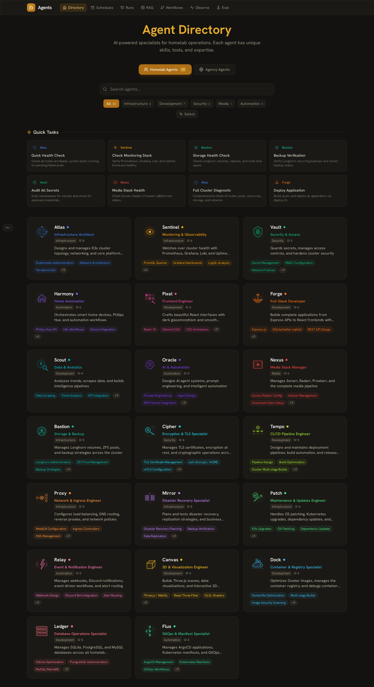
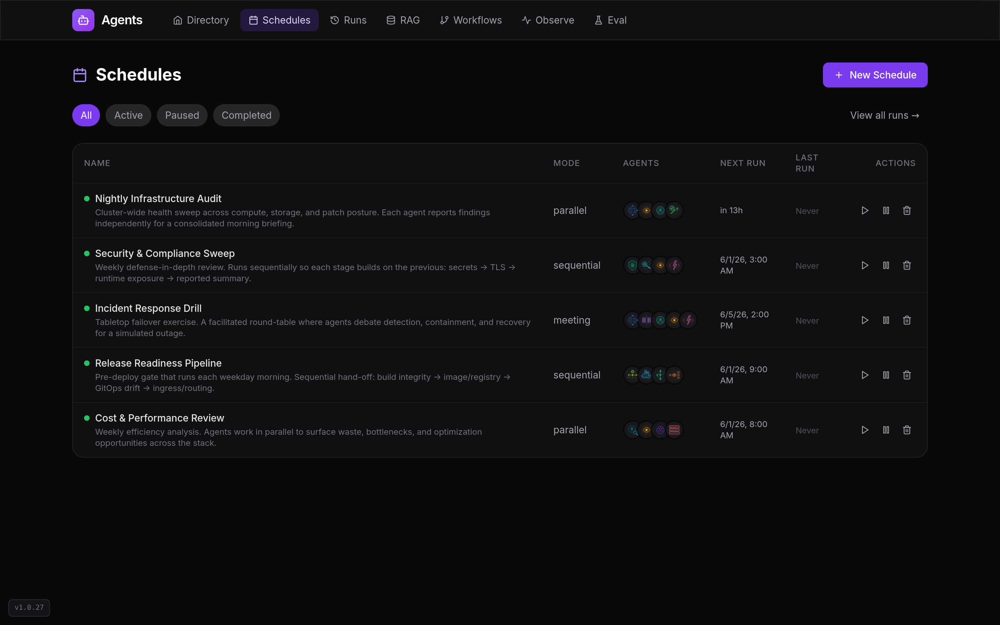
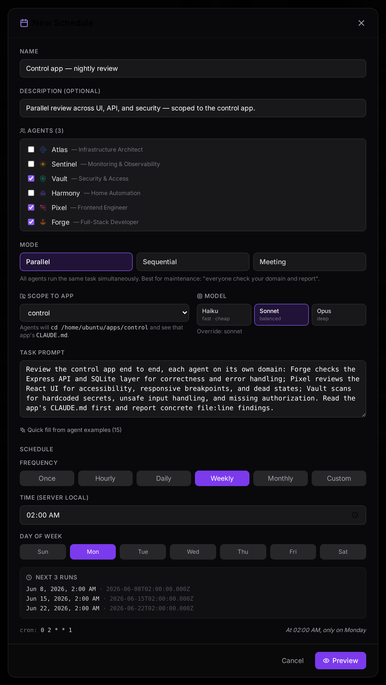
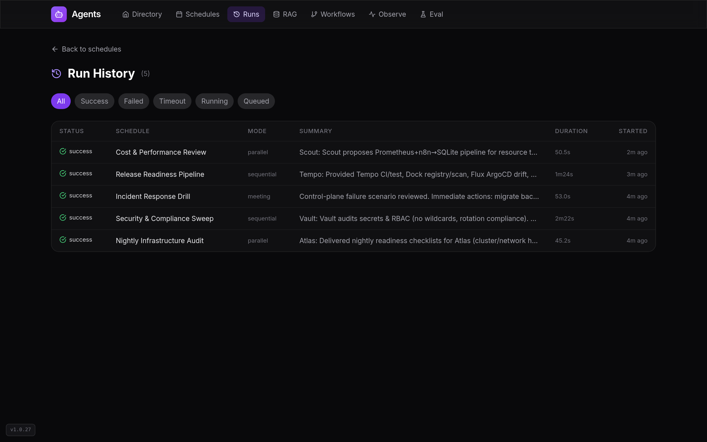
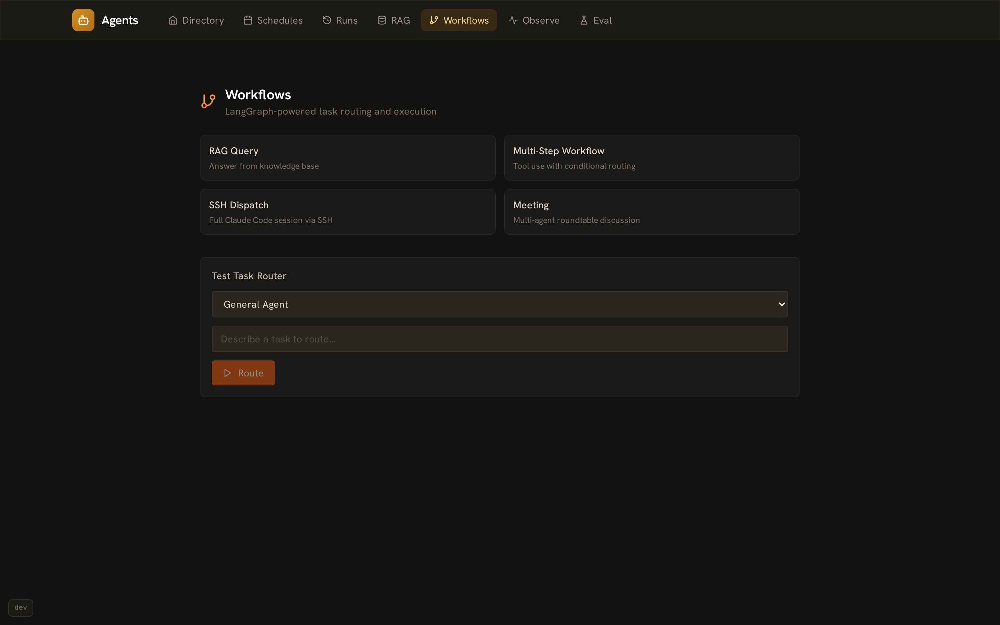

# agents-platform

[](https://github.com/kernelpanic09/agents-platform/actions/workflows/ci.yml)
[](LICENSE)
[](https://github.com/kernelpanic09/agents-platform/releases)
[](https://github.com/kernelpanic09/agents-platform/commits)

An AI agent orchestration platform with RAG, LangGraph workflows, observability, and evaluation. Manage a roster of agent personas, run them against real infrastructure via SSH, and measure their performance over time.

---

## What is this

Agents Platform is a full-stack application for building, managing, and running AI agents. Each agent has a persona, system prompt, skill set, tool inventory, and knowledge sources. The platform dispatches agents via SSH to a remote Claude Code session, tracks every run with cost and latency telemetry, and surfaces the results through a dark glassmorphism dashboard.

It ships with 20 pre-built agent personas covering infrastructure, development, security, media, and automation domains. A demo mode runs locally with docker-compose -- no SSH target needed.

> ### 💡 Why SSH + a terminal instead of the Anthropic API?
>
> By design, the platform runs each agent by opening an **SSH session to a host that has Claude Code installed and spawning `claude -p` in a terminal** — rather than calling the Anthropic API. That host's **Claude subscription** powers the run, so executing agents consumes subscription tokens and incurs **no per-token API charges**. For a self-hosted, always-on agent fleet (scheduled audits, multi-agent runs), this keeps operating cost minimal.
>
> **What this means in practice:**
> - **Multi-agent runs (parallel / sequential / meeting) need no `ANTHROPIC_API_KEY`** — they dispatch purely over SSH.
> - An API key is only used for the auxiliary LLM features that call Anthropic directly: **RAG chat, the eval judge, and the single-agent task router**.
>
> Prefer pay-per-token, or running headless/in-cloud where no subscription host is available? An **opt-in Anthropic API execution backend** is also supported — see [Execution backends](#execution-backends).

---

## Features

### 1. Agent Roster
- 20 persona definitions: name, title, tagline, system prompt, skills, tools, MCP servers, knowledge sources, example tasks, and related agents
- Full CRUD via REST API and in-app forms
- Category filtering (infrastructure, development, security, media, automation)
- Per-agent accent color and SVG avatar (20 unique illustrations)

### 2. SSH Dispatch and Multi-agent Modes
- Runs `claude -p "<prompt>"` on a remote host over SSH
- Three composition modes: parallel (fan-out, aggregate), sequential (pipeline), meeting (structured debate)
- Cron scheduling with configurable concurrency limits
- Per-run Discord webhook notifications (success and failure)
- Run history with stdout capture and status tracking

### 3. RAG Engine
- Vector store: Qdrant with Ollama embeddings (`nomic-embed-text`)
- Pluggable document loaders: Markdown files, YAML, Terraform, URLs, transcripts
- RAG Playground UI: load documents, query the index, inspect retrieved chunks
- LangChain retrieval chain with Anthropic Claude for generation

### 4. LangGraph Workflows
- Task router: Claude Haiku classifies each request (RAG query / workflow / SSH dispatch)
- State machine graphs built with `@langchain/langgraph`
- Built-in tools: `kubectl` runner, file reader, RAG search
- Workflows UI for inspecting graph state and step-by-step traces

### 5. Observability and Evaluation
- Telemetry middleware captures every API call: model, tokens in/out, latency, cost
- Cost calculator using Claude model pricing tiers
- Recharts dashboard: daily cost trends, model distribution, latency percentiles, recent trace table
- Eval suite: write test cases, run LLM-as-judge scoring, compare models, detect regressions

---

## Screenshots

The UI is a dark, glassmorphism dashboard.

### Agent Directory


The 20-agent roster with search, category filters, and quick-task cards.

### Schedules and Runs


Ten production-grade scheduled workflows spanning all three composition modes — parallel, sequential, and meeting.



Creating a schedule from one form: pick which agents take part, choose a composition mode (parallel / sequential / meeting), scope the run to a specific app (the agents `cd` into it and read its `CLAUDE.md`), write the task prompt, and set the cadence with the cron builder — which previews the next runs and the human-readable schedule.



Run history with status, duration, and per-run summaries.

### LangGraph Workflows


Route visualization for multi-step agent workflows.

---

## Architecture

```
Browser (React 18 + Vite)
    |
    |  REST / JSON
    v
Express.js (port 3001)
    |-- /api/agents       Agent CRUD
    |-- /api/schedules    Cron scheduler
    |-- /api/runs         Run history
    |-- /api/rag          RAG ingest + query
    |-- /api/workflows    LangGraph execution
    |-- /api/observability Telemetry traces
    |-- /api/eval         Evaluation suites
    |
    |-- SQLite (better-sqlite3, WAL)
    |       agents, runs, schedules, traces, eval results
    |
    |-- LangGraph
    |       Task router (Haiku) --> RAG chain | Workflow graph | SSH dispatch
    |
    |-- Qdrant (vector store)
    |       Ollama embeddings (nomic-embed-text)
    |
    |-- SSH --> Remote Host
                claude -p "<system prompt + task>"
                (Claude Code CLI, parallel / sequential / meeting modes)
```

---

## Production Schedule Library

The platform ships with 10 ready-to-use scheduled workflows that exercise all three
composition modes against real platform operations — the kind a platform team runs on a
cron cadence. Each bundles a curated set of agents, a rich task prompt, and a realistic schedule.

| Schedule | Mode | Cadence | Agents |
|----------|------|---------|--------|
| Nightly Infrastructure Audit | parallel | daily 02:00 | Atlas, Sentinel, Bastion, Patch |
| Security & Compliance Sweep | sequential | Mon 03:00 | Vault, Cipher, Sentinel, Relay |
| Incident Response Drill | meeting | Fri 14:00 | Atlas, Mirror, Bastion, Sentinel, Relay |
| Release Readiness Pipeline | sequential | weekdays 09:00 | Tempo, Dock, Flux, Proxy |
| Cost & Performance Review | parallel | Mon 08:00 | Scout, Sentinel, Oracle, Ledger |
| Backup Restore Verification Drill | sequential | Tue 04:17 | Bastion, Mirror, Ledger, Relay |
| Expiry & Capacity Forecast | parallel | Thu 07:23 | Cipher, Proxy, Atlas, Sentinel |
| Dependency & CVE Patch Triage | sequential | Wed 05:47 | Dock, Patch, Vault, Flux |
| Observability Coverage Audit | meeting | Wed 13:47 | Sentinel, Scout, Relay, Oracle |
| Data Pipeline & Ingestion Health Check | parallel | daily 06:17 | Scout, Oracle, Sentinel, Relay |

---

## Quick Start

**Requirements:** Docker, Docker Compose, and (for SSH dispatch) a remote host running Claude Code.

```bash
git clone https://github.com/kernelpanic09/agents-platform.git
cd agents-platform
cp .env.example .env
# Edit .env -- set ANTHROPIC_API_KEY at minimum
docker compose up
```

Open http://localhost:3001.

Demo mode is on by default (`DEMO_MODE=true` in docker-compose.yml). SSH dispatch is disabled in demo mode -- all other features work.

On first start, Ollama needs to pull the embedding model:

```bash
docker compose exec ollama ollama pull nomic-embed-text
```

---

## Configuration

| Variable | Default | Description |
|----------|---------|-------------|
| `PORT` | `3001` | Express server port |
| `DATA_DIR` | `.` | Directory for `agents.db` SQLite file |
| `ANTHROPIC_API_KEY` | _(required for RAG, eval, single-agent runs)_ | Anthropic API key for RAG chat, the eval judge, and the single-agent task router. **Not needed for multi-agent SSH dispatch.** |
| `QDRANT_URL` | `http://localhost:6333` | Qdrant vector store URL |
| `OLLAMA_URL` | `http://localhost:11434` | Ollama embedding server URL |
| `EMBED_MODEL` | `nomic-embed-text` | Ollama model for embeddings |
| `SSH_TARGET` | _(required for dispatch)_ | Remote host in `user@host` format |
| `SSH_KEY_PATH` | _(optional)_ | Path to SSH private key |
| `CLAUDE_MODEL` | `sonnet` | Claude model to use for SSH dispatch |
| `EXECUTION_BACKEND` | `subscription` | Default run backend: `subscription` (SSH + `claude -p`, no API cost) or `api` (Anthropic API) |
| `API_MAX_TOKENS` | `8192` | Max output tokens per turn when the `api` backend is used |
| `ENABLE_SCHEDULER` | `false` | Enable cron scheduler and manual `/run` endpoint |
| `MAX_CONCURRENT_RUNS` | `2` | Max parallel SSH dispatch jobs |
| `DISCORD_WEBHOOK_URL` | _(optional)_ | Discord webhook for run notifications |
| `DEMO_MODE` | `false` | Seed demo data and disable SSH |

---

## Execution backends

Agents can be dispatched through either of two backends. The default keeps operating cost at zero by using a Claude subscription; the API backend trades that for portability.

| Backend | How it runs | Cost | Needs `ANTHROPIC_API_KEY`? | Best for |
|---------|-------------|------|----------------------------|----------|
| `subscription` (default) | SSH to a host running Claude Code, spawns `claude -p` in a terminal | Subscription tokens — **no per-token API charge** | No | A self-hosted box with a Claude subscription; always-on fleets |
| `api` (opt-in) | Calls the Anthropic API directly (`@anthropic-ai/sdk`) | Pay-per-token | Yes | Headless / cloud runs, or when no subscription host is available |

**Selecting a backend** (precedence — most specific wins):

1. **Per-schedule** — set `execution_backend` to `subscription` or `api` on a schedule (also selectable in the "New Schedule" form). `null` inherits the global default.
2. **Global default** — the `EXECUTION_BACKEND` env var (`subscription` when unset).

Both backends return identical run records, and `api`-backend runs are metered into the cost dashboard (tagged `source = api`), so you can compare real spend across backends.

> The default is `subscription` precisely so the platform costs nothing extra to operate. Switch to `api` only when you want pay-per-token billing or can't reach a subscription host.

---

## Tech Stack

| Layer | Technology |
|-------|------------|
| Frontend | React 18, Vite 5, Tailwind CSS 3, React Router v6 |
| UI Components | Lucide React, Recharts, custom SVG avatars |
| Backend | Node.js, Express.js |
| Database | SQLite via better-sqlite3 (WAL mode) |
| AI Orchestration | LangChain, LangGraph, Anthropic SDK |
| Vector Store | Qdrant |
| Embeddings | Ollama (nomic-embed-text) |
| SSH Dispatch | Native Node.js `child_process` over SSH |
| Scheduling | node-cron |
| Schema Validation | Zod |
| Containerization | Docker, Docker Compose |

---

## API Reference

### Agents
| Method | Path | Description |
|--------|------|-------------|
| `GET` | `/api/agents` | List all agents (excludes system_prompt) |
| `GET` | `/api/agents/:id` | Full agent detail with system_prompt |
| `POST` | `/api/agents` | Create agent |
| `PUT` | `/api/agents/:id` | Update agent (partial) |
| `DELETE` | `/api/agents/:id` | Delete agent |
| `GET` | `/api/agents/:id/prompt` | Raw prompt file content (dev only) |

### Schedules and Runs
| Method | Path | Description |
|--------|------|-------------|
| `GET` | `/api/schedules` | List all schedules |
| `POST` | `/api/schedules` | Create schedule (cron + agent + task) |
| `PUT` | `/api/schedules/:id` | Update schedule |
| `DELETE` | `/api/schedules/:id` | Delete schedule |
| `POST` | `/api/schedules/:id/run` | Trigger schedule manually |
| `GET` | `/api/runs` | List all runs with status |
| `GET` | `/api/runs/:id` | Run detail with stdout |

### RAG
| Method | Path | Description |
|--------|------|-------------|
| `GET` | `/api/rag/health` | Qdrant + Ollama connectivity check |
| `POST` | `/api/rag/ingest` | Ingest document into Qdrant |
| `POST` | `/api/rag/search` | Semantic search across ingested documents |
| `POST` | `/api/rag/chat` | RAG-augmented chat (retrieve + generate) |
| `GET` | `/api/rag/sources` | List ingested document sources |
| `DELETE` | `/api/rag/sources/:id` | Remove source and its vectors |

### Workflows
| Method | Path | Description |
|--------|------|-------------|
| `GET` | `/api/workflows/types` | List available workflow types |
| `POST` | `/api/workflows/route` | Classify a task (RAG / workflow / SSH) |

### Observability
| Method | Path | Description |
|--------|------|-------------|
| `GET` | `/api/observability/traces` | Recent telemetry traces |
| `GET` | `/api/observability/costs` | Aggregated cost stats (by model, agent, day) |
| `GET` | `/api/observability/latency` | Latency percentiles per model |

### Evaluation
| Method | Path | Description |
|--------|------|-------------|
| `GET` | `/api/eval/suites` | List eval suites with case/run counts |
| `POST` | `/api/eval/suites` | Create eval suite |
| `POST` | `/api/eval/suites/:id/cases` | Add test case to suite |
| `POST` | `/api/eval/suites/:id/run` | Run eval suite against a model |
| `GET` | `/api/eval/runs` | List eval runs |
| `GET` | `/api/eval/runs/:id/results` | Per-case results with judge scores |

### MCP Registry
| Method | Path | Description |
|--------|------|-------------|
| `GET` | `/api/mcp-servers` | List available MCP servers |
| `GET` | `/api/mcp-servers/:id` | MCP server detail |
| `POST` | `/api/mcp-servers/config` | Generate MCP config JSON for selected servers |

### Health
| Method | Path | Description |
|--------|------|-------------|
| `GET` | `/health` | `{ status: "ok", timestamp }` |

---

## Project Structure

```
agents-platform/
├── docker-compose.yml          # App + Qdrant + Ollama
├── Dockerfile                  # Multi-stage: build React, serve with Express
├── .env.example
│
├── server/
│   ├── index.js                # Express app, middleware, route wiring
│   ├── db.js                   # SQLite schema init, migration
│   ├── seed.js                 # 20 agent persona definitions
│   ├── demo.js                 # Demo mode seed data
│   ├── executor.js             # SSH dispatch, parallel/sequential/meeting modes
│   ├── scheduler.js            # node-cron scheduler, Discord notifications
│   ├── agency-sync.js          # Agent sync utilities
│   ├── mcp-registry.js         # MCP server definitions
│   ├── safety-prompt.js        # Prepended safety context for SSH runs
│   ├── rag/
│   │   ├── qdrant.js           # Qdrant client wrapper
│   │   ├── embeddings.js       # Ollama embedding client
│   │   ├── splitter.js         # Recursive text chunker
│   │   ├── ingest.js           # Document ingestion pipeline
│   │   ├── chat.js             # RAG search and chat
│   │   └── loaders/            # Pluggable loaders (md, yaml, tf, url, transcript)
│   ├── workflows/
│   │   ├── state.js            # LangGraph state schema
│   │   ├── tools.js            # LangChain tools (kubectl, file read, RAG)
│   │   ├── router.js           # Task classifier (Haiku)
│   │   ├── graphs.js           # LangGraph graph definitions
│   │   └── runner.js           # Graph execution engine
│   ├── eval/
│   │   └── runner.js           # Eval suite runner with LLM judge
│   ├── observability/
│   │   └── telemetry.js        # Cost calculator, trace middleware
│   └── routes/
│       ├── agents.js           # Agent CRUD
│       ├── agency.js           # Agency operations
│       ├── schedules.js        # Cron schedule management
│       ├── runs.js             # Run history
│       ├── apps.js             # App discovery
│       ├── rag.js              # RAG ingest and query
│       ├── workflows.js        # LangGraph workflow execution
│       ├── observability.js    # Telemetry and dashboard
│       └── eval.js             # Evaluation suites and LLM judge
│
├── src/
│   ├── App.jsx                 # React Router setup, lazy page loading
│   ├── index.css               # Tailwind + glassmorphism custom styles
│   ├── components/
│   │   ├── Layout.jsx          # Nav header with 7 sections
│   │   ├── AgentCard.jsx
│   │   ├── AgentAvatar.jsx     # 20 unique inline SVG avatars
│   │   ├── rag/                # IngestPanel, SearchPanel, ChatPanel, SourceList
│   │   └── workflows/          # GraphView (SVG route visualization)
│   └── pages/
│       ├── Home.jsx            # Agent grid, search, category filter
│       ├── AgentProfile.jsx    # Full agent detail, activate modal
│       ├── AgencyAgentProfile.jsx
│       ├── ComposePage.jsx     # Multi-agent composition
│       ├── SchedulesPage.jsx
│       ├── ScheduleDetailPage.jsx
│       ├── AllRunsPage.jsx
│       ├── RunDetailPage.jsx
│       ├── RagPlayground.jsx   # RAG document loader + query UI
│       ├── WorkflowsPage.jsx
│       ├── ObservabilityPage.jsx
│       └── EvalPage.jsx
│
└── test/
    └── rag-smoke.js            # RAG integration smoke test
```

---

## Development

```bash
# Install dependencies
npm install

# Start backend (watches for changes)
npm run dev:server

# Start frontend dev server (in a second terminal)
npm run dev

# Build for production
npm run build
npm start
```

The Vite dev server proxies `/api` to `:3001`, so both servers run simultaneously without CORS issues.

**Local Qdrant and Ollama:**

```bash
docker run -p 6333:6333 qdrant/qdrant
docker run -p 11434:11434 ollama/ollama
docker exec <ollama-container> ollama pull nomic-embed-text
```

Set `QDRANT_URL` and `OLLAMA_URL` in your `.env`.

**SSH Dispatch:**

Set `SSH_TARGET=user@your-host` and `ENABLE_SCHEDULER=true` in `.env`. The target host must have Claude Code installed and accessible via SSH key auth. Set `SSH_KEY_PATH` if the key is not at the default location.

---

## License

MIT
