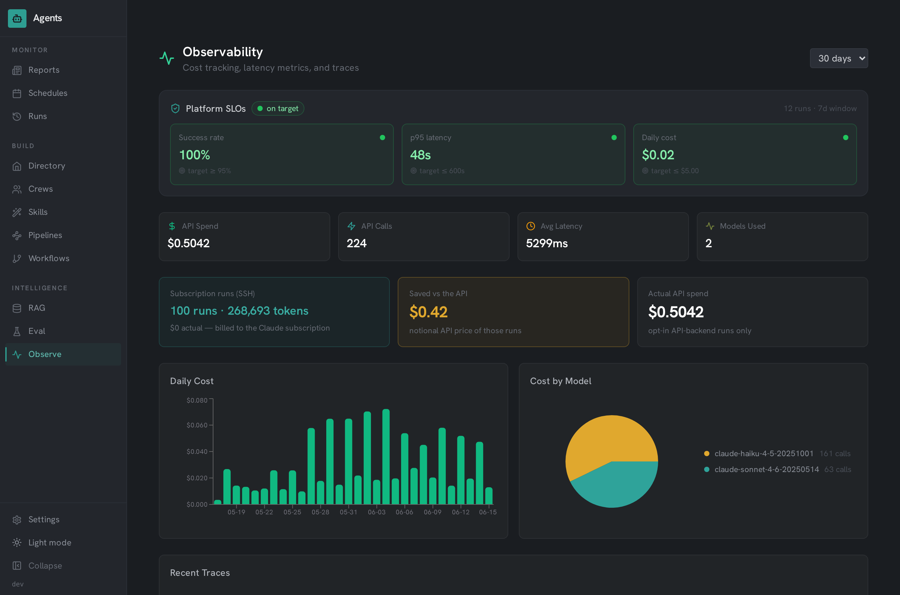
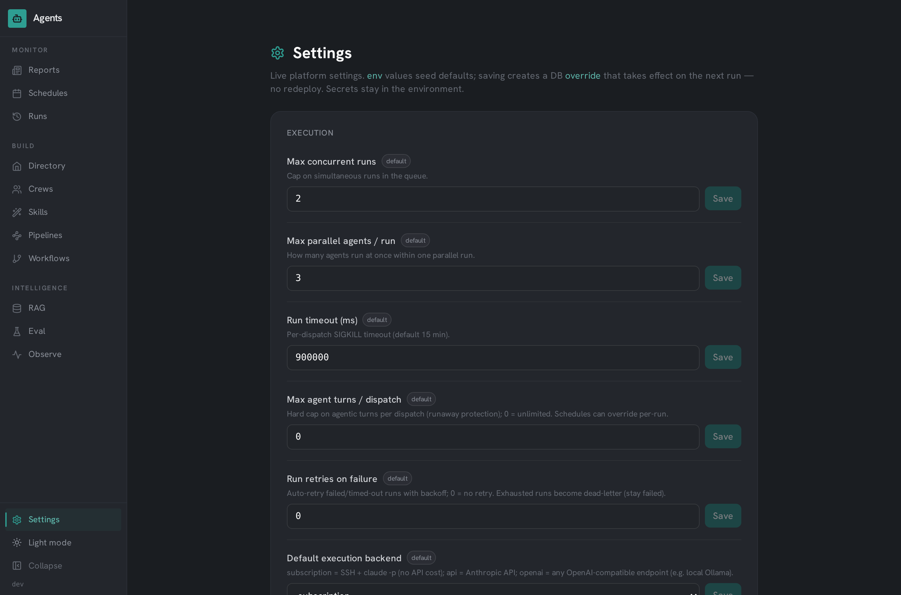

# agents-platform

[](https://github.com/kernelpanic09/agents-platform/actions/workflows/ci.yml)
[](LICENSE)
[](https://github.com/kernelpanic09/agents-platform/releases)
[](https://github.com/kernelpanic09/agents-platform/commits)

An AI agent orchestration platform: a roster of agent personas dispatched against real infrastructure, composed into conditional DAG pipelines and reusable crews, streamed live over SSE, governed by tiered safety policies and scoped API keys, and improved over time with prompt versioning, A/B evals, and a promote-to-active loop - with full cost/latency observability and platform SLOs.


*Live capture from the production deployment (3× speed): an Incident Triage pipeline fires, Sentinel sweeps the cluster and flags a `CRITICAL` finding, and the DAG routes to Atlas + Relay in real time - then a tour of Crews and the SLO dashboard.*

---

## What is this

Agents Platform is a full-stack application for building, managing, and running AI agents. Each agent has a persona, system prompt, skill set, tool inventory, knowledge sources, and its own inference profile (model, temperature, max tokens). The platform dispatches agents via SSH to a remote Claude Code session (or the Anthropic API), routes multi-agent work through LangGraph - including user-built DAG pipelines with conditional branching - tracks every run with token/cost/latency telemetry, and streams run progress live into the UI.

It ships with 20 pre-built agent personas covering infrastructure, development, security, media, and automation domains, plus 10 production-grade schedule templates. A demo mode runs locally with docker-compose -- no SSH target needed.

The platform was built in five planned phases (visibility → configurability → trust → self-improvement → composability); the full roadmap, meeting notes, and prioritization live in [`docs/planning/`](docs/planning/).

> ### Why SSH + a terminal instead of the Anthropic API?
>
> By design, the platform runs each agent by opening an **SSH session to a host that has Claude Code installed and spawning `claude -p` in a terminal** - rather than calling the Anthropic API. That host's **Claude subscription** powers the run, so executing agents consumes subscription tokens and incurs **no per-token API charges**. For a self-hosted, always-on agent fleet (scheduled audits, multi-agent runs), this keeps operating cost minimal.
>
> **What this means in practice:**
> - **Multi-agent runs (parallel / sequential / meeting) need no `ANTHROPIC_API_KEY`** - they dispatch purely over SSH.
> - An API key is only used for the auxiliary LLM features that call Anthropic directly: **RAG chat, the eval judge, and the single-agent task router**.
>
> Prefer pay-per-token, or running headless/in-cloud where no subscription host is available? An **opt-in Anthropic API execution backend** is also supported - see [Execution backends](#execution-backends).

---

## Features

### 1. Agent Roster
- 20 persona definitions: name, title, tagline, system prompt, skills, tools, MCP servers, knowledge sources, example tasks, and related agents
- Full CRUD via REST API and in-app forms; per-agent accent color and SVG avatar (20 unique illustrations)
- **Per-agent inference profiles** - model, temperature, and max-tokens overrides applied at execution time
- **Prompt version history** - every system-prompt edit auto-snapshots the prior version; view, diff, and restore from the agent profile
- **Adopt from catalog** - one-click adoption from a 140+ agent public catalog into the runnable roster; adopted agents carry provenance (`source_pack`) and become schedulable, crewable, and pipeline-ready alongside the built-ins

### 2. Orchestration: Modes, Pipelines, and Crews
- Runs `claude -p "<prompt>"` on a remote host over SSH - or via the Anthropic API, or **any OpenAI-compatible endpoint incl. local Ollama** (see [Execution backends](#execution-backends))
- Three composition modes: parallel (fan-out, aggregate), sequential (pipeline), meeting (structured debate)
- **DAG Pipeline Builder** - compose agents into a directed graph with **conditional edges evaluated against the prior agent's output** (e.g. `output.includes('CRITICAL')`, sandboxed in a `vm` context). Pipelines compile to LangGraph at run time and stream per-node status live onto the graph
- **Saved Crews** - named, reusable agent teams with a topology (fan / chain / round-table), one-click run or schedule, plus suggested crews derived from the related-agents graph
- Cron scheduling with configurable concurrency; per-run Discord notifications

### 3. Live Run Streaming
- Every run streams **per-agent lifecycle events over SSE**: watch agents start, work, and report in real time instead of waiting on a spinner
- Pipeline runs overlay live node status (pending / running / success / failed) directly on the DAG
- Finished runs replay from history; mid-run viewers catch up from a buffered event stream

### 4. Trust & Governance
- **Enforced safety tiers** - `read_only` disables the file-mutation tools (`Write`, `Edit`, `MultiEdit`, `NotebookEdit`) at the CLI permission layer, not just in the prompt; the policy preamble remains as defense-in-depth (shell commands stay policy-governed - documented boundary)
- **Human-in-the-loop approval gate** - `supervised`-tier runs hold in `pending_approval` and notify the operator; nothing dispatches until explicitly approved (or rejected) from the run page
- **Turn limits** - a hard cap on agentic turns per dispatch (`--max-turns`), settable per schedule or as a platform default; runaway protection that is enforced, not advisory
- **Structured run verdicts** - every agent must end with `STATUS: ok|attention|critical`; the parsed verdict is stored per run, surfaced as severity badges, and available to pipeline routing (`verdict === 'critical'`)
- **Scoped API keys** (`read` → `trigger` → `write` → `admin`, SHA-256 hashed) protecting the external trigger surface
- **Inbound webhooks** - `POST /api/webhooks/:token` fires a schedule from Prometheus alerts, git pushes, or n8n flows, with payload interpolation into the task prompt
- **Durable job queue** - the runs table is the queue: crash recovery re-queues orphaned runs on boot, failed runs retry with exponential backoff, exhausted runs land in a dead-letter state with one-click re-queue

### 5. Settings Hub
- Live platform settings with clear precedence: **DB override → env seed → code default** - tune concurrency, timeouts, models, retention, safety preamble, and SLO targets at runtime with no redeploy
- Model allowlist editable live (add a new Claude model without shipping code)

### 6. RAG Engine
- Vector store: Qdrant with Ollama embeddings (`nomic-embed-text`)
- Pluggable document loaders: Markdown files, YAML, Terraform, URLs, transcripts
- RAG Playground UI: load documents, query the index, inspect retrieved chunks
- LangChain retrieval chain with Anthropic Claude for generation

### 7. LangGraph Workflows
- Task router: Claude Haiku classifies each request (RAG query / workflow / SSH dispatch)
- State machine graphs built with `@langchain/langgraph` - including **dynamic graphs compiled from user-built pipelines**
- Built-in tools: `kubectl` runner, file reader, RAG search

### 8. Observability, SLOs, and Cost
- Telemetry for **both backends**: API calls and SSH runs (token usage parsed from `claude`'s JSON output) - every run lands in the cost dashboard
- **"Savings vs API" view** - subscription runs cost $0 but are metered at notional API prices, so the dashboard shows exactly what the SSH design saves
- **Platform SLOs** - success rate, p95 run latency, and daily cost vs live-configurable targets, with green/warning/breach status and Discord alerting on transition into breach
- Recharts dashboard: daily cost trends, model distribution, latency percentiles, recent traces

### 9. Evaluation & Self-Improvement
- Eval suites with LLM-as-judge scoring; judge model and pass threshold are configurable per run
- **Prompt A/B testing** - score the agent's current prompt (A) against a candidate (B) on the same suite, side by side
- **Promote-to-active** - one click sets the winning prompt live (auto-snapshotting the old one), closing the measure → improve → ship loop

### 10. Portability: Agent Packs & MCP Registry
- **Agent-pack YAML import/export** - versioned packs of agents, crews, schedules, and pipelines; cross-references travel by agent *name*, so a pack moves cleanly between deployments
- **DB-backed MCP registry** - the integration catalog is editable at runtime (add/edit/delete servers, no redeploy), with per-server env-var validation badges and a remote connection test

---

## Screenshots

The UI is a flat dark dashboard with an amber primary and teal secondary accent (Hanken Grotesk type, status-pill badges - deliberately not the default AI-glassmorphism look).

### Agent Directory


The 20-agent roster with search, category filters, and quick-task cards.

### Pipelines - conditional DAG orchestration


A real run of the *Incident Triage* pipeline with both routing styles in play: Sentinel's sweep contained `CRITICAL`, so the graph escalated to **Atlas** while **Relay** (the always-edge) fired in parallel; Atlas investigated and reported `STATUS: attention`, so the `verdict === 'critical'` edge to the **Incident Response Commander** (an agent adopted from the agency catalog) correctly did not fire. Node labels show each agent's structured verdict; statuses stream onto the DAG live over SSE, and the builder below edits nodes and conditional edges in place.

### Crews - saved agent teams


Reusable teams with fan / chain / round-table topologies, one-click run or schedule, and suggested crews derived from the related-agents graph.

### Live Run Streaming


A four-agent sequential crew run streaming over SSE (6x speed): each agent's panel flips queued -> running -> success in real time as the chain progresses, with per-agent summaries landing as they finish - no polling, no spinner.

### Agency Catalog and Adoption


A 140+ agent catalog synced from a public agent repository. One click adopts an entry into the runnable roster (provenance-tagged), after which it is schedulable, crewable, and usable as a pipeline node - the capture above adopts the DevOps Automator and lands on the roster, where adopted agents carry a `catalog` chip. The Incident Response Commander in the pipeline above came from here. Demo mode seeds a complete example: an adopted Code Reviewer composed with the built-in personas in a schedule and a crew.

### Schedules and Runs


Ten production-grade scheduled workflows spanning all three composition modes - parallel, sequential, and meeting.


Creating a schedule from one form: pick which agents take part, choose a composition mode (parallel / sequential / meeting), scope the run to a specific app (the agents `cd` into it and read its `CLAUDE.md`), pick a model, an **execution backend** (subscription SSH vs Anthropic API), and a **safety tier** (read-only / controlled / supervised), then set the cadence with the cron builder.


Run history with status, duration, and per-run summaries.

### Observability and Platform SLOs


Success rate, p95 latency, and daily cost against live-configurable SLO targets - plus the cost split that makes the SSH design legible: subscription runs metered at notional API prices ("Saved vs the API") next to actual opt-in API spend.

### Settings Hub


Live platform settings with source badges (env seed vs DB override vs default) - concurrency, timeouts, models, safety, retention, and SLO targets tune at runtime with no redeploy. The same page manages scoped API keys, the MCP registry, and agent-pack import/export.

### LangGraph Workflows


The LangGraph routing layer: workflow types and the task router that classifies each request (RAG / multi-step workflow / SSH dispatch).

---

## Architecture

```
Browser (React 18 + Vite)
    |
    |  REST / JSON + SSE (live run streams)
    v
Express.js (port 3001)
    |-- /api/agents        Agent CRUD, inference profiles, prompt versions
    |-- /api/schedules     Cron scheduler
    |-- /api/runs          Run history + SSE stream + retry
    |-- /api/pipelines     DAG builder, validation, runs + SSE node overlay
    |-- /api/crews         Saved agent teams (run / schedule)
    |-- /api/packs         YAML import/export of agents/crews/schedules/pipelines
    |-- /api/webhooks      Inbound event triggers (token-authenticated)
    |-- /api/keys          Scoped API keys
    |-- /api/settings      Live settings hub (DB > env > default)
    |-- /api/mcp-servers   DB-backed MCP registry + env/connection checks
    |-- /api/rag           RAG ingest + query
    |-- /api/workflows     LangGraph routing
    |-- /api/observability Telemetry, costs, SLOs
    |-- /api/eval          Evaluation suites + A/B testing
    |
    |-- SQLite (better-sqlite3, WAL)
    |       agents, schedules, runs (durable queue), pipelines, crews,
    |       traces, eval suites/runs, prompt_versions, api_keys,
    |       platform_settings, mcp_servers
    |
    |-- LangGraph
    |       Task router (Haiku) --> RAG chain | Workflow graph | SSH dispatch
    |       Pipeline DAGs compiled at run time (conditional edges, fan-out)
    |
    |-- Qdrant (vector store)
    |       Ollama embeddings (nomic-embed-text)
    |
    |-- SSH --> Remote Host                      (default backend)
    |           claude -p "<safety tier + system prompt + task>"
    |           (Claude Code CLI, parallel / sequential / meeting / pipeline)
    |
    |-- Anthropic API                            (opt-in backend)
```

---

## Production Schedule Library

The platform ships with 10 ready-to-use scheduled workflows that exercise all three
composition modes against real platform operations - the kind a platform team runs on a
cron cadence. Each bundles a curated set of agents, a rich task prompt, and a realistic schedule.

| Schedule | Mode | Cadence | Agents |
|----------|------|---------|--------|
| Nightly Infrastructure Audit | parallel | daily 02:00 | Atlas, Sentinel, Bastion, Patch |
| Security & Compliance Sweep | sequential | Mon 03:00 | Vault, Cipher, Sentinel, Relay |
| Incident Response Drill | meeting | Fri 14:00 | Atlas, Mirror, Bastion, Sentinel, Relay |
| Release Readiness Pipeline | sequential | weekdays 09:00 | Tempo, Dock, Flux, Proxy |
| Cost & Performance Review | parallel | Mon 08:00 | Scout, Sentinel, Oracle, Ledger |
| Backup Restore Verification Drill | sequential | Tue 04:17 | Bastion, Mirror, Ledger, Relay |
| Expiry & Capacity Forecast | parallel | Thu 07:23 | Cipher, Proxy, Atlas, Sentinel |
| Dependency & CVE Patch Triage | sequential | Wed 05:47 | Dock, Patch, Vault, Flux |
| Observability Coverage Audit | meeting | Wed 13:47 | Sentinel, Scout, Relay, Oracle |
| Data Pipeline & Ingestion Health Check | parallel | daily 06:17 | Scout, Oracle, Sentinel, Relay |

---

## Quick Start

**Requirements:** Docker, Docker Compose, and (for SSH dispatch) a remote host running Claude Code.

```bash
git clone https://github.com/kernelpanic09/agents-platform.git
cd agents-platform
cp .env.example .env
# Edit .env -- set ANTHROPIC_API_KEY at minimum
docker compose up
```

Open http://localhost:3001.

Demo mode is on by default (`DEMO_MODE=true` in docker-compose.yml). SSH dispatch is disabled in demo mode -- all other features work.

On first start, Ollama needs to pull the embedding model:

```bash
docker compose exec ollama ollama pull nomic-embed-text
```

---

## Configuration

> **Live settings:** most operational knobs (concurrency, timeouts, default model, model allowlist, retries, retention, safety preamble, SLO targets, SSH target, execution backend) are editable at runtime in **Settings** - stored as DB overrides with precedence **DB > env > default**. The env vars below seed the defaults; secrets (API keys, SSH keys, webhook tokens) stay in the environment only.

| Variable | Default | Description |
|----------|---------|-------------|
| `PORT` | `3001` | Express server port |
| `DATA_DIR` | `.` | Directory for `agents.db` SQLite file |
| `ANTHROPIC_API_KEY` | _(required for RAG, eval, single-agent runs)_ | Anthropic API key for RAG chat, the eval judge, and the single-agent task router. **Not needed for multi-agent SSH dispatch.** |
| `QDRANT_URL` | `http://localhost:6333` | Qdrant vector store URL |
| `OLLAMA_URL` | `http://localhost:11434` | Ollama embedding server URL |
| `EMBED_MODEL` | `nomic-embed-text` | Ollama model for embeddings |
| `SSH_TARGET` | _(required for dispatch)_ | Remote host in `user@host` format |
| `SSH_KEY_PATH` | _(optional)_ | Path to SSH private key |
| `CLAUDE_MODEL` | `sonnet` | Claude model to use for SSH dispatch |
| `EXECUTION_BACKEND` | `subscription` | Default run backend: `subscription` (SSH + `claude -p`, no API cost), `api` (Anthropic API), or `openai` (any OpenAI-compatible endpoint) |
| `API_MAX_TOKENS` | `8192` | Max output tokens per turn for the `api` / `openai` backends |
| `OPENAI_BASE_URL` | _(required for `openai` backend)_ | Any OpenAI-compatible base URL, e.g. `http://ollama:11434/v1` for free local models |
| `OPENAI_API_KEY` | `none` | Bearer token for the OpenAI-compatible endpoint (local servers accept anything) |
| `OPENAI_MODEL` | `qwen2.5:7b` | Default model for the `openai` backend when a run specifies a Claude alias |
| `ENABLE_SCHEDULER` | `false` | Enable cron scheduler and manual `/run` endpoint |
| `MAX_CONCURRENT_RUNS` | `2` | Max runs executing at once (queue concurrency) |
| `MAX_PARALLEL_PER_RUN` | `3` | Max agents dispatched simultaneously within one parallel run |
| `RUN_TIMEOUT_MS` | `900000` | Per-dispatch timeout (15 min) |
| `RUN_MAX_RETRIES` | `0` | Auto-retries (with backoff) for failed/timed-out runs; exhausted runs dead-letter |
| `DEFAULT_MAX_TURNS` | `0` | Hard cap on agentic turns per dispatch (0 = unlimited); schedules can override |
| `RETENTION_MAX_RUNS_PER_SCHEDULE` | `200` | Keep newest N runs per schedule (pruned nightly) |
| `RETENTION_MAX_AGE_DAYS` | `90` | Drop finished runs older than this |
| `DISCORD_WEBHOOK_URL` | _(optional)_ | Discord webhook for run + SLO-breach notifications |
| `DEMO_MODE` | `false` | Seed demo data and disable SSH |

---

## Execution backends

Agents can be dispatched through either of two backends. The default keeps operating cost at zero by using a Claude subscription; the API backend trades that for portability.

| Backend | How it runs | Cost | Needs a key? | Best for |
|---------|-------------|------|--------------|----------|
| `subscription` (default) | SSH to a host running Claude Code, spawns `claude -p` in a terminal | Subscription tokens - **no per-token API charge** | No | A self-hosted box with a Claude subscription; always-on fleets |
| `api` (opt-in) | Calls the Anthropic API directly (`@anthropic-ai/sdk`) | Pay-per-token | `ANTHROPIC_API_KEY` | Headless / cloud runs, or when no subscription host is available |
| `openai` (opt-in) | Calls any **OpenAI-compatible** `/chat/completions` endpoint (plain `fetch`, no SDK) | Free if pointed at **local Ollama / vLLM**; otherwise provider pricing | `OPENAI_BASE_URL` (+ key for hosted) | Fully-local models, air-gapped runs, or any non-Anthropic provider |

**Selecting a backend** (precedence - most specific wins):

1. **Per-schedule** - set `execution_backend` to `subscription`, `api`, or `openai` on a schedule (also selectable in the "New Schedule" form). `null` inherits the global default.
2. **Global default** - the `execution_backend` live setting / `EXECUTION_BACKEND` env var (`subscription` when unset).

Both backends return identical run records, and `api`-backend runs are metered into the cost dashboard (tagged `source = api`), so you can compare real spend across backends.

> The default is `subscription` precisely so the platform costs nothing extra to operate. Switch to `api` only when you want pay-per-token billing or can't reach a subscription host.

---

## Tech Stack

| Layer | Technology |
|-------|------------|
| Frontend | React 18, Vite 5, Tailwind CSS 3, React Router v6 |
| UI Components | Lucide React, Recharts, custom SVG avatars |
| Backend | Node.js, Express.js |
| Database | SQLite via better-sqlite3 (WAL mode) |
| AI Orchestration | LangChain, LangGraph, Anthropic SDK, OpenAI-compatible REST |
| Vector Store | Qdrant |
| Embeddings | Ollama (nomic-embed-text) |
| SSH Dispatch | Native Node.js `child_process` over SSH |
| Live Streaming | Server-Sent Events (native, no extra deps) |
| Scheduling | node-cron + durable SQLite-backed run queue |
| Portability | `yaml` (agent packs) |
| Schema Validation | Zod |
| Containerization | Docker, Docker Compose |

---

## API Reference

### Agents
| Method | Path | Description |
|--------|------|-------------|
| `GET` | `/api/agents` | List all agents (excludes system_prompt) |
| `GET` | `/api/agents/:id` | Full agent detail with system_prompt |
| `POST` | `/api/agents` | Create agent |
| `PUT` | `/api/agents/:id` | Update agent (auto-snapshots prompt edits) |
| `PUT` | `/api/agents/:id/model-config` | Set inference profile (model / temperature / max_tokens) |
| `GET` | `/api/agents/:id/prompt-versions` | Prompt version history |
| `POST` | `/api/agents/:id/prompt-versions/:vid/restore` | Restore a prior prompt version |
| `DELETE` | `/api/agents/:id` | Delete agent |
| `POST` | `/api/agency/:id/adopt` | Copy a catalog agent into the runnable roster |

### Live Run Streaming


A four-agent sequential crew run streaming over SSE (6x speed): each agent's panel flips queued -> running -> success in real time as the chain progresses, with per-agent summaries landing as they finish - no polling, no spinner.

### Agency Catalog and Adoption


A 140+ agent catalog synced from a public agent repository. One click adopts an entry into the runnable roster (provenance-tagged), after which it is schedulable, crewable, and usable as a pipeline node - the capture above adopts the DevOps Automator and lands on the roster, where adopted agents carry a `catalog` chip. The Incident Response Commander in the pipeline above came from here. Demo mode seeds a complete example: an adopted Code Reviewer composed with the built-in personas in a schedule and a crew.

### Schedules and Runs
| Method | Path | Description |
|--------|------|-------------|
| `GET` | `/api/schedules` | List all schedules |
| `POST` | `/api/schedules` | Create schedule (cron + agents + mode + safety tier + backend) |
| `PUT` | `/api/schedules/:id` | Update schedule |
| `DELETE` | `/api/schedules/:id` | Delete schedule |
| `POST` | `/api/schedules/:id/run` | Trigger schedule manually |
| `GET` | `/api/runs` | List all runs with status |
| `GET` | `/api/runs/:id` | Run detail with stdout |
| `GET` | `/api/runs/:id/stream` | **SSE** - live per-agent events (replays finished runs) |
| `POST` | `/api/runs/:id/retry` | Re-queue a finished / dead-lettered run |
| `POST` | `/api/runs/:id/approve` | Release a supervised-tier run held for approval |
| `POST` | `/api/runs/:id/reject` | Decline a held run (terminal, never dispatches) |

### Pipelines (DAG)
| Method | Path | Description |
|--------|------|-------------|
| `GET/POST` | `/api/pipelines` | List / create pipelines |
| `GET/PUT/DELETE` | `/api/pipelines/:id` | Read / update (cycle-checked) / delete |
| `POST` | `/api/pipelines/:id/validate` | Validate a graph without saving |
| `POST` | `/api/pipelines/:id/run` | Execute through LangGraph (fire-and-forget) |
| `GET` | `/api/pipelines/:id/runs` | Pipeline run history |
| `GET` | `/api/pipelines/runs/:runId` | Run detail with per-node states |
| `GET` | `/api/pipelines/runs/:runId/stream` | **SSE** - live node-status overlay |

### Crews
| Method | Path | Description |
|--------|------|-------------|
| `GET/POST` | `/api/crews` | List / create crews (fan / chain / round-table) |
| `GET` | `/api/crews/suggested` | Crews derived from the related-agents graph |
| `PUT/DELETE` | `/api/crews/:id` | Update / delete |
| `POST` | `/api/crews/:id/run` | One-click run (one-shot schedule through the queue) |

### Packs, Settings, Keys, Webhooks
| Method | Path | Description |
|--------|------|-------------|
| `GET` | `/api/packs/export?include=…` | Versioned YAML export (agents, crews, schedules, pipelines) |
| `POST` | `/api/packs/import` | Import a pack (name-resolved, clash-safe, warns on unknowns) |
| `GET/PUT/DELETE` | `/api/settings[/:key]` | Live settings (DB override > env > default) |
| `GET/POST/DELETE` | `/api/keys[/:id]` | Scoped API keys (read / trigger / write / admin) |
| `GET/POST/DELETE` | `/api/webhooks[/:id]` | Inbound webhook endpoints |
| `POST` | `/api/webhooks/:token` | Fire a schedule from an external event |

### RAG
| Method | Path | Description |
|--------|------|-------------|
| `GET` | `/api/rag/health` | Qdrant + Ollama connectivity check |
| `POST` | `/api/rag/ingest` | Ingest document into Qdrant |
| `POST` | `/api/rag/search` | Semantic search across ingested documents |
| `POST` | `/api/rag/chat` | RAG-augmented chat (retrieve + generate) |
| `GET` | `/api/rag/sources` | List ingested document sources |
| `DELETE` | `/api/rag/sources/:id` | Remove source and its vectors |

### Workflows
| Method | Path | Description |
|--------|------|-------------|
| `GET` | `/api/workflows/types` | List available workflow types |
| `POST` | `/api/workflows/route` | Classify a task (RAG / workflow / SSH) |

### Observability
| Method | Path | Description |
|--------|------|-------------|
| `GET` | `/api/observability/traces` | Recent telemetry traces (API + SSH sources) |
| `GET` | `/api/observability/costs` | Aggregated cost stats incl. "savings vs API" |
| `GET` | `/api/observability/latency` | Latency percentiles per model |
| `GET` | `/api/observability/slo` | Platform SLOs vs targets (ok / warn / breach) |

### Evaluation
| Method | Path | Description |
|--------|------|-------------|
| `GET` | `/api/eval/suites` | List eval suites with case/run counts |
| `POST` | `/api/eval/suites` | Create eval suite |
| `POST` | `/api/eval/suites/:id/cases` | Add test case to suite |
| `POST` | `/api/eval/suites/:id/run` | Run suite (configurable judge model + pass threshold) |
| `POST` | `/api/eval/suites/:id/ab` | **A/B test** current prompt vs a candidate |
| `GET` | `/api/eval/runs` | List eval runs |
| `GET` | `/api/eval/runs/:id/results` | Per-case results with judge scores |

### MCP Registry (DB-backed)
| Method | Path | Description |
|--------|------|-------------|
| `GET/POST` | `/api/mcp-servers` | List / add servers at runtime (no redeploy) |
| `GET/PUT/DELETE` | `/api/mcp-servers/:id` | Read / edit / remove a server |
| `GET` | `/api/mcp-servers/:id/check` | Env-var validation (required vs missing) |
| `POST` | `/api/mcp-servers/:id/test` | Remote connection test over SSH |
| `POST` | `/api/mcp-servers/config` | Generate MCP config JSON for selected servers |

### Health
| Method | Path | Description |
|--------|------|-------------|
| `GET` | `/health` | `{ status: "ok", timestamp }` |

---

## Project Structure

```
agents-platform/
├── docker-compose.yml          # App + Qdrant + Ollama
├── Dockerfile                  # Multi-stage: build React, serve with Express
├── .env.example
│
├── server/
│   ├── index.js                # Express app, middleware, route wiring
│   ├── db.js                   # SQLite schema init, idempotent migrations
│   ├── seed.js                 # 20 agent persona definitions
│   ├── demo.js                 # Demo mode seed data
│   ├── executor.js             # Backend-agnostic dispatch (SSH + API), prompts, telemetry
│   ├── scheduler.js            # Durable run queue, cron, retries, retention, SLO monitor
│   ├── run-stream.js           # SSE event registry w/ replay buffer (live run streaming)
│   ├── settings.js             # Live settings: DB override > env seed > default
│   ├── api-keys.js             # Scoped API keys (SHA-256, scope middleware)
│   ├── packs.js                # Agent-pack YAML export/import + agency adoption
│   ├── agency-sync.js          # Agency catalog sync from GitHub
│   ├── mcp-registry.js         # DB-backed MCP registry + env/connection checks
│   ├── safety-prompt.js        # Tiered safety policy engine (read_only/controlled/supervised)
│   ├── rag/                    # Qdrant client, embeddings, chunker, ingest, chat, loaders
│   ├── workflows/
│   │   ├── state.js            # LangGraph state schema
│   │   ├── tools.js            # LangChain tools (kubectl, file read, RAG)
│   │   ├── router.js           # Task classifier (Haiku)
│   │   ├── graphs.js           # Static LangGraph graph definitions
│   │   ├── pipeline.js         # Dynamic DAG -> LangGraph compiler, sandboxed conditions
│   │   └── runner.js           # Graph execution engine (all modes)
│   ├── eval/
│   │   └── runner.js           # Eval runner: LLM judge, prompt override, A/B support
│   ├── observability/
│   │   ├── telemetry.js        # Cost calculator, trace recording (api + ssh sources)
│   │   └── slo.js              # SLO computation + breach alerting
│   └── routes/                 # agents, agency, schedules, runs, pipelines, crews,
│                               # packs, settings, keys, webhooks, mcp, apps, rag,
│                               # workflows, observability, eval
│
├── src/
│   ├── App.jsx                 # React Router setup, lazy page loading
│   ├── index.css               # Tailwind + flat-dark theme (amber/teal accents)
│   ├── components/
│   │   ├── Layout.jsx          # Nav header
│   │   ├── AgentCard.jsx / AgentAvatar.jsx   # 20 unique inline SVG avatars
│   │   ├── StatusBadge.jsx     # Run-status pills
│   │   ├── PipelineGraph.jsx   # SVG DAG renderer w/ live node status
│   │   ├── ScheduleModal.jsx / CronBuilder.jsx
│   │   ├── rag/                # IngestPanel, SearchPanel, ChatPanel, SourceList
│   │   └── workflows/          # GraphView (SVG route visualization)
│   └── pages/                  # Home, AgentProfile (inference profile + prompt history),
│                               # Compose, Schedules, ScheduleDetail, Runs, RunDetail (live SSE),
│                               # Pipelines, PipelineDetail (builder + live overlay), Crews,
│                               # RagPlayground, Workflows, Observability (SLOs), Eval (A/B),
│                               # Settings (hub + keys + MCP registry + packs)
│
└── test/                       # 32 unit tests (node:test):
    ├── pipeline.test.js        #   DAG validation, sandboxed conditions, LangGraph routing
    ├── packs.test.js           #   YAML pack round-trip, agency adoption
    ├── mcp.test.js             #   registry seed/CRUD/env checks
    ├── slo.test.js             #   SLO status bands + roll-up
    ├── api-keys.test.js        #   scopes, hashing, middleware
    ├── safety-tier.test.js     #   tier resolution + policy prompts
    ├── execution-backend.test.js
    ├── run-stream.test.js
    └── rag-smoke.js            # RAG integration smoke test
```

---

## Development

```bash
# Install dependencies
npm install

# Start backend (watches for changes)
npm run dev:server

# Start frontend dev server (in a second terminal)
npm run dev

# Build for production
npm run build
npm start

# Run the unit test suite (32 tests, no API key or SSH needed)
npm test
```

The Vite dev server proxies `/api` to `:3001`, so both servers run simultaneously without CORS issues.

**Local Qdrant and Ollama:**

```bash
docker run -p 6333:6333 qdrant/qdrant
docker run -p 11434:11434 ollama/ollama
docker exec <ollama-container> ollama pull nomic-embed-text
```

Set `QDRANT_URL` and `OLLAMA_URL` in your `.env`.

**SSH Dispatch:**

Set `SSH_TARGET=user@your-host` and `ENABLE_SCHEDULER=true` in `.env`. The target host must have Claude Code installed and accessible via SSH key auth. Set `SSH_KEY_PATH` if the key is not at the default location.

---

## License

MIT
